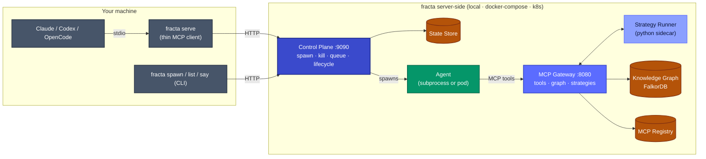
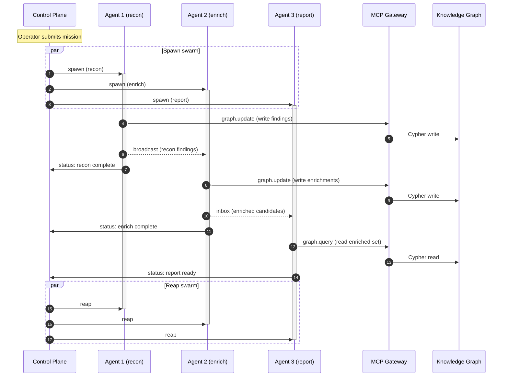

# Fracta: A Swarm Intelligence Engine

Fracta is the system materialization of the explore/exploit pattern for AI agents.

Reasoning loops are inherently non-deterministic, as sampling, context, and model versions naturally drift. Fracta bridges the gap between open-ended AI reasoning and rigid, reproducible analytics by splitting the workload into exploration (agents discovering context) and exploitation (strategies running deterministic logic on those discoveries).

## How It Works

Your machine runs the AI CLI you already use. Everything else — the control plane, the MCP gateway, the strategy runner, the knowledge graph, and the agents themselves — runs server-side, whether "server" means a local process, a Docker Compose stack, or a Kubernetes cluster.

Reading the diagram in explore/exploit terms: the agents on the right are the **explore** loop, reasoning over MCP tools and writing what they find into the knowledge graph. The strategy runner is the **exploit** loop, reading the graph and staged data and returning deterministic results that the agents (or you) can act on without re-reasoning.



The thin client (`fracta serve`) is always the same. Only the infrastructure behind the control plane changes — see [Architecture](docs/introduction/architecture.md) for the full breakdown.

## Core Architecture

Fracta is built on four main pillars that operate over a shared trust boundary:

- **🎛️ Control Plane & The Chessmaster (Swarm Orchestration)**
  Manages the lifecycle and orchestration of the agent swarm. At its core is the Chessmaster, the central orchestrator that spawns agent workers and assigns each a specific mission (an explicit objective they need to achieve). It facilitates parallel reasoning, concurrent execution, and unattended operations across the entire system.

- **🤖 The "Explore" Phase: Agents**
  Agents act as the workers handling open-ended investigation, contextual reasoning, and deciding what to explore next to fulfill their missions. To collaborate effectively, agents communicate with each other and the Chessmaster via a robust internal mailbox system, utilizing inbox (direct messaging), intention (signaling planned actions), and broadcast (swarm-wide updates) mechanics. Fracta is agnostic to the agent runtime (you can use whatever AI CLI you already rely on, such as Claude Code, Codex, or OpenCode).

- **⚙️ The "Exploit" Phase: Strategies (Deterministic Execution)**
  Strategies are deterministic Python pipelines that encode reproducible analytics on top of what the swarm has discovered. Crucially, these strategies are created directly based on the results of the exploration phase. At this point, humans need to intentionally create and refine these strategies iteratively based on exploration results, using their agentic coding CLI of choice. In the future, Fracta workers will be able to automatically suggest or derive strategies directly from recurring exploration patterns. This is how you run fast, millisecond-level operations (counts, joins, correlations, sliding windows, map-reduce, detection rules) with zero LLM in the loop.

- **🔌 MCP Gateway (Tool Registration & Concurrency)**
  A native Model Context Protocol (MCP) server that manages tool registration and natively handles high-concurrency connections. It exposes the exact same tool catalog across two distinct client modes:
  - **Agentic Calling**: Agents driving tools via an LLM.
  - **Non-Agentic Calling**: Strategies driving tools through deterministic Python.
  - **Unified Concurrency**: Parallelism is persistent and native. The gateway seamlessly manages concurrent execution, whether that is a swarm of agents exploring independently, five deterministic strategies executing at the exact same time, or multiple client modes operating simultaneously (all securely sharing the same tools and trust boundary).

- **🗺️ Knowledge Graph & Ontologies**
  The shared world model capturing the swarm's state. It goes beyond simple memory by carrying strict ontologies, which define valid entity types, relationships, and dynamics. Ontologies are seeded upfront and extended at runtime as agents discover new shapes, providing concrete structural guarantees that Strategies can reliably query against.

### Example: a 3-agent swarm

The pillars above describe the system at rest. Here's an interaction trace of three agents running a `recon → enrich → report` pipeline against the swarm — spawned in parallel, each calling MCP tools through the gateway, coordinating peer-to-peer via inbox/broadcast messages, reporting status back to the control plane, and reaped together when the mission completes:



Scaling from 3 to 30 agents changes nothing about this trace structure — the control plane fans out spawns and reaps, agents talk to the gateway in parallel, and peer messages flow between any two agents that need to coordinate.

## Use Cases

Because the architecture makes no assumptions about coding-specific tasks, it acts as a universal engine for any workflow requiring parallel agentic reasoning backed by deterministic logic. Use it for:

- Security investigations and active defense
- Operations triage and root cause analysis
- Large-scale data exploration
- Complex code refactoring

## Why Fracta? The Problem We Are Solving

AI agents excel at open-ended exploration, but they struggle with efficiency and reproducibility once a task becomes routine. Fracta was built to solve the friction of transitioning from "agentic discovery" to "production-grade automation."

### The Limits of Current Approaches

- **Token Waste & Drift**: Once an agent discovers a "happy path" (a successful sequence of actions), repeating that path using traditional prompt engineering or standard harnesses (like agents.md, claude.md, or custom system instructions) is incredibly inefficient. It still relies on non-deterministic LLM interpretation, risking output drift and consuming copious amounts of tokens just to do the exact same job twice.
- **The Complexity Ceiling of Visual Automation**: On the other end of the spectrum, you can encode deterministic paths using visual workflow tools (like n8n). However, as these automations reach high levels of complexity, they become tangled, impossible to debug, and exceptionally difficult to version-control or share with other developers.

### The Fracta Solution

Fracta resolves this tension by allowing you to easily encode agentic reasoning into deterministic, reproducible paths that operate at scale.

- **🐍 Strategies as Pure Python DAGs**: We encode deterministic paths into Python strategies. These run reliably without LLM interpretation, saving tokens and guaranteeing reproducible outcomes.
- **🛠️ Unified Tooling**: These deterministic strategies leverage the exact same MCP tools that the AI agents use during their non-deterministic exploration. You do not need to build your tools twice.
- **⚡ High-Performance State Transfer**: To bridge the gap between agents and strategies, Fracta uses high-performance DuckDB and Parquet as staging databases. These act as the ultra-fast communication medium and data handoff point between open-ended exploration and rigid execution.
- **🤝 Agnostic & Shareable Contracts**: Strategies are built around a strict contract, making them portable and shareable. Because infrastructure varies, each user can simply attach their own `binding.yaml` to a strategy. This satisfies the contract requirements based on the specific nuances of their unique environment, without needing to rewrite the core logic.

### Agents as a Programmable Compute Layer

Fracta fundamentally shifts how we view AI agents. It treats them as a programmable compute layer rather than standalone tools.

Fracta does not care which agentic runtimes (Claude, OpenAI, local models) are doing the work in the backend. Instead, it provides the robust infrastructure to support them:

- A shared bus for standardized logging.
- A shared messaging pipeline (inbox, intention, broadcast).
- A shared graph database to continuously encode the state of the world.
- A shared strategy execution engine.

**The Result**: You can deploy hundreds or thousands of containerized agent pods at any given time. They can run concurrently, solve independent missions, communicate securely with each other, and update the global state of the world in real-time.

## Install

### Docker image (Compose / Kubernetes)

The release pipeline publishes multi-arch images (`linux/amd64`, `linux/arm64`) to GitHub Container Registry:

```bash
docker pull ghcr.io/darkquasar/fracta:latest
docker run --rm ghcr.io/darkquasar/fracta:latest fracta --version
```

Available tags:

- `ghcr.io/darkquasar/fracta:vX.Y.Z` — exact version
- `ghcr.io/darkquasar/fracta:X.Y` — minor-version alias (auto-bumped)
- `ghcr.io/darkquasar/fracta:X` — major-version alias (auto-bumped)
- `ghcr.io/darkquasar/fracta:latest` — most recent stable release

The scaffolded Compose and Kubernetes manifests reference this image — `fracta init --scaffold docker-compose` or `--scaffold k8s` wires it in for you.

### Prebuilt binaries (local-process mode)

Each tagged release ships statically linked binaries for `linux/{amd64,arm64}` and `darwin/{amd64,arm64}` on the [GitHub Releases page](https://github.com/darkquasar/fracta/releases), each with a `.sha256` sidecar.

### Build from source

```bash
make build          # Go binary → bin/fracta
make docker-build   # Docker image (for Compose/K8s)
```

Requires Go 1.25+. See [Building from source](docs/development/building.md) for the full reference.

## Deployment Modes

| Mode | Complexity | Quickstart |
|------|-----------|-----------|
| Local Process | Lowest — everything on your machine | [Local Process Quickstart](docs/guides/deployment/local-process.md) |
| Docker Compose | Medium — containerized stack | [Docker Compose Quickstart](docs/guides/deployment/docker-compose.md) |
| Kubernetes | Highest — agents as K8s Jobs | [Kubernetes Quickstart](docs/guides/deployment/kubernetes.md) |

## Reference

| Doc | Covers |
|-----|--------|
| [Installation](docs/getting-started/installation.md) | Prerequisites, installing fracta, picking a mode |
| [Core Concepts](docs/getting-started/core-concepts.md) | Architecture, credentials, mode selection |
| [Deployment Overview](docs/guides/deployment/overview.md) | Detailed architecture and config for all three modes |
| [Runtime Configuration](docs/guides/authentication/runtime-configuration.md) | Claude, Codex, OpenCode adapter setup |
| [Credential Pipeline](docs/guides/authentication/credential-pipeline.md) | Authentication deep dive |
| [Strategies](docs/strategies/overview.md) | Python DAG pipelines for investigations |
| [Kubernetes Runbook](docs/guides/deployment/kubernetes-runbook.md) | Complete K8s runbook with troubleshooting |
| [Kubernetes Configuration](docs/configuration/kubernetes.md) | `extra_volumes`, auth-helpers ConfigMap, `/opt/fracta/auth-helpers/` PATH convention |
| [MCP Catalog](docs/reference/cli/config-mcp.md) | `fracta config mcp` — fetch the server catalog and wire servers into your scaffold |
