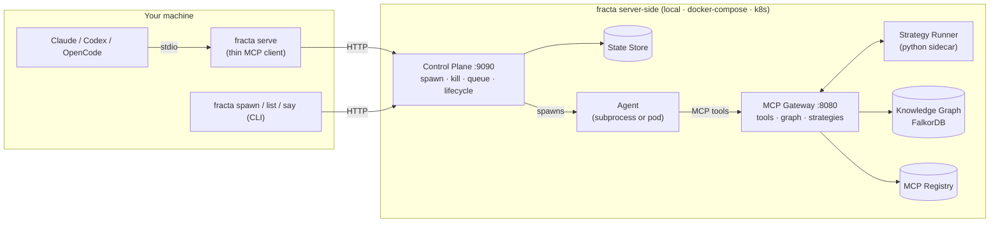

# Fracta

Fracta is a **swarm intelligence engine** for AI agents — the system materialization of the explore/exploit pattern. **Agents handle exploration**: parallel reasoning, open-ended investigation, deciding what to look at next. **Strategies handle exploitation**: deterministic Python pipelines that encode reproducible analytics on top of what the swarm has discovered. The graph in the middle is more than a shared world model — it carries **ontologies**: nodes and edges that declare which entity types exist, which relationships are valid, and which dynamics are allowed. Ontologies are seeded upfront and extended at runtime as agents discover new shapes; strategies can rely on those guarantees when they query.

That split is the headline. Reasoning loops are non-deterministic by design — sampling, context, model version all drift. Strategies are how you encode the *deterministic* parts of an investigation (counts, joins, correlations, sliding windows, map-reduce, automation logic, detection rules, composable analytics, etc.) so they run reproducibly, in milliseconds. The mechanism that makes this possible is the **MCP gateway**: a native MCP server that exposes the same tool catalog to *two client modes* — agents driving it through an LLM, and strategies driving it through deterministic Python. Same tools, same trust boundary, no LLM in the loop on the strategy side.

Four pillars: the **agent swarm** (explore), the **MCP gateway** (the dual-client tool layer that enrols new MCP servers and accepts parallel concurrent connections, unattended), the **knowledge graph** (capture, with ontologies governing what shapes are valid), and the **strategy framework** (exploit). The agent runtime is whatever AI CLI you already use — Claude Code, Codex, OpenCode today; the architecture has nothing coding-specific about it. Use it for security investigations, ops triage, data exploration, code refactors, anything where you want many agents reasoning in parallel and deterministic logic running on top of what they find.

**[Getting Started Guide](docs/getting-started.md)** — start here.

## How It Works

Your machine runs the AI CLI you already use. Everything else — the control plane, the MCP gateway, the strategy runner, the knowledge graph, and the agents themselves — runs server-side, whether "server" means a local process, a Docker Compose stack, or a Kubernetes cluster.

Reading the diagram in explore/exploit terms: the agents on the right are the **explore** loop, reasoning over MCP tools and writing what they find into the knowledge graph. The strategy runner is the **exploit** loop, reading the graph and staged data and returning deterministic results that the agents (or you) can act on without re-reasoning.



The thin client (`fracta serve`) is always the same. Only the infrastructure behind the control plane changes — see [Architecture](docs/introduction/architecture.md) for the full breakdown.

## Deployment Modes

| Mode | Complexity | Quickstart |
|------|-----------|-----------|
| Local Process | Lowest — everything on your machine | [quickstart-local-process.md](docs/quickstart-local-process.md) |
| Docker Compose | Medium — containerized stack | [quickstart-docker-compose.md](docs/quickstart-docker-compose.md) |
| Kubernetes | Highest — agents as K8s Jobs | [quickstart-kubernetes.md](docs/quickstart-kubernetes.md) |

## Build

```bash
make build          # Go binary → bin/fracta
make docker-build   # Docker image (for Compose/K8s)
```

## Reference

| Doc | Covers |
|-----|--------|
| [Getting Started](docs/getting-started.md) | Architecture, credentials, mode selection |
| [Deployment Modes](docs/deployment-modes.md) | Detailed architecture and config for all three modes |
| [Runtime Configuration](docs/runtime-configuration.md) | Claude, Codex, OpenCode adapter setup |
| [Credential Pipeline](docs/credential-pipeline.md) | Authentication deep dive |
| [Strategies](docs/strategies.md) | Python DAG pipelines for investigations |
| [Local K8s Guide](docs/local-k8s.md) | Complete K8s runbook with troubleshooting |
