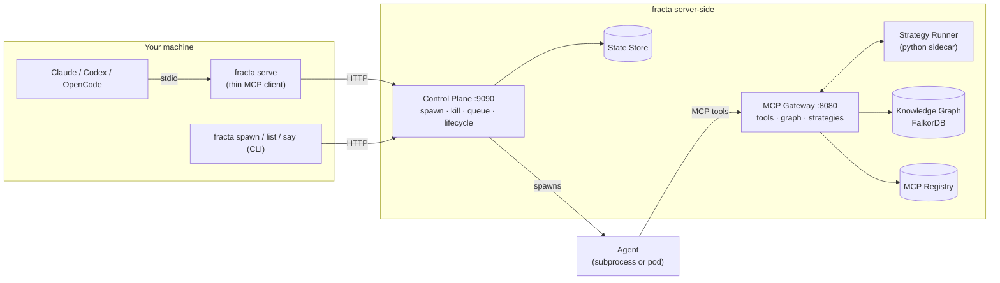

# Fracta

Multi-agent orchestration for Claude Code, Codex, and OpenCode. Spawn parallel AI agents, coordinate their work, and manage their lifecycle — all from your existing AI CLI.

**[Getting Started Guide](docs/getting-started.md)** — start here.

## How It Works



The thin client (`fracta serve`) is always the same. Only the infrastructure behind the control plane changes — see [Architecture](docs/introduction/architecture.md) for the full breakdown.

## Deployment Modes

| Mode | Complexity | Quickstart |
|------|-----------|-----------|
| Local Process | Lowest — everything on your machine | [quickstart-local-process.md](docs/quickstart-local-process.md) |
| Docker Compose | Medium — containerized stack | [quickstart-docker-compose.md](docs/quickstart-docker-compose.md) |
| Kubernetes | Highest — agents as K8s Jobs | [quickstart-kubernetes.md](docs/quickstart-kubernetes.md) |

## Build

```bash
make build          # Go binary → bin/fracta
make docker-build   # Docker image (for Compose/K8s)
```

## Reference

| Doc | Covers |
|-----|--------|
| [Getting Started](docs/getting-started.md) | Architecture, credentials, mode selection |
| [Deployment Modes](docs/deployment-modes.md) | Detailed architecture and config for all three modes |
| [Runtime Configuration](docs/runtime-configuration.md) | Claude, Codex, OpenCode adapter setup |
| [Credential Pipeline](docs/credential-pipeline.md) | Authentication deep dive |
| [Strategies](docs/strategies.md) | Python DAG pipelines for investigations |
| [Local K8s Guide](docs/local-k8s.md) | Complete K8s runbook with troubleshooting |
