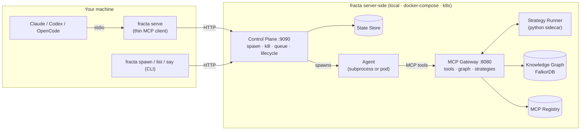

# Fracta

Fracta is a **swarm intelligence engine** that builds a model of your world in a graph database, then runs **deterministic strategies** against that model. Parallel AI agents explore the world — logs, alerts, code, infrastructure — and capture what they find as nodes and edges in FalkorDB. Once the world is mapped, strategies — versioned Python pipelines — execute analytics, correlations, and detections directly against the graph and staged data. No LLM in the loop, no sampling drift, no token burn for work that's just SQL and joins.

The swarm uses Claude Code, Codex, or OpenCode as the agent runtime — same CLI you already use. Fracta is the layer that spawns them in parallel git worktrees, routes their MCP tool calls through a shared gateway, persists what they discover, and lets you run reproducible workflows on top of it all.

**[Getting Started Guide](docs/getting-started.md)** — start here.

## How It Works

Your machine runs the AI CLI you already use. Everything else — the control plane, the MCP gateway, the strategy runner, the knowledge graph, and the agents themselves — runs server-side, whether "server" means a local process, a Docker Compose stack, or a Kubernetes cluster. The diagram below maps to the three stages: the AI CLI drives the swarm; the control plane spawns and supervises agents; the MCP gateway routes their tool calls and feeds discoveries into the knowledge graph; the strategy runner executes deterministic Python pipelines on top of the captured world.



The thin client (`fracta serve`) is always the same. Only the infrastructure behind the control plane changes — see [Architecture](docs/introduction/architecture.md) for the full breakdown.

## Deployment Modes

| Mode | Complexity | Quickstart |
|------|-----------|-----------|
| Local Process | Lowest — everything on your machine | [quickstart-local-process.md](docs/quickstart-local-process.md) |
| Docker Compose | Medium — containerized stack | [quickstart-docker-compose.md](docs/quickstart-docker-compose.md) |
| Kubernetes | Highest — agents as K8s Jobs | [quickstart-kubernetes.md](docs/quickstart-kubernetes.md) |

## Build

```bash
make build          # Go binary → bin/fracta
make docker-build   # Docker image (for Compose/K8s)
```

## Reference

| Doc | Covers |
|-----|--------|
| [Getting Started](docs/getting-started.md) | Architecture, credentials, mode selection |
| [Deployment Modes](docs/deployment-modes.md) | Detailed architecture and config for all three modes |
| [Runtime Configuration](docs/runtime-configuration.md) | Claude, Codex, OpenCode adapter setup |
| [Credential Pipeline](docs/credential-pipeline.md) | Authentication deep dive |
| [Strategies](docs/strategies.md) | Python DAG pipelines for investigations |
| [Local K8s Guide](docs/local-k8s.md) | Complete K8s runbook with troubleshooting |
