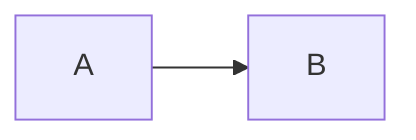

# Agent guidance — `docs/` directory

This file contains rules for AI assistants (Claude Code, Cursor, etc.) when editing or generating content inside `docs/`. Read this before making changes in this directory.

The fracta docs site is built by **[Mintlify](https://mintlify.com)**, which compiles `.md` and `.mdx` files using an MDX parser. MDX is Markdown plus JSX, which means **some Markdown syntax that works elsewhere will fail to build here.** This file lists the gotchas that have already been hit at least once — every entry below is from a real build failure.

If you hit a new failure mode, add a section here so the next agent doesn't re-discover it.

---

## Hard rules

### 0. Don't write spec-style prose in user-facing docs

We have our own, independent fracta's design ledger. It contains spec proposals (`spec-42-runtime-bootstrap-and-scaffolds`, etc.), task lists, breaking-change codes (`BC1`, `BC2`, `BC4`), section markers (`§4.10`, `§11 R3`), and risk identifiers (`R1`, `R7`). That vocabulary is internal — it tracks *how* a change was designed.

User docs describe the *resulting* feature: what works, what flags exist, what files get scaffolded, what an error message means. Operators reading the docs should not need a spec to make sense of a docs page.

**Don't write under `docs/`:**

- A migration page titled by spec ID ("spec-42 image-auth migration", "BC4 walkthrough").
- Long-form prose explaining what a spec changed, the rationale of breaking changes by code, or "what spec-43 will do".
- "See spec-42 §11 R7 for the path-traversal contract" as a primary reference for an operator.

**Do write under `docs/`:**

- "The scaffold walker rejects entries with `..` segments or absolute paths before any write." (describes behavior)
- Operator-facing breaking-change announcements in CHANGELOG / release notes (those reach operators through a different channel; they may legitimately reference the spec).
- A short inline citation as a *secondary* reference — fine if it's brief and doesn't replace user-facing explanation. Example: "(see spec-42 §6 for the discovery contract)" trailing a sentence that's already self-contained.

The bar is: **a docs page must be useful to an operator who has never seen specs** If removing every spec citation leaves the page incomprehensible, the page is doing the spec's job, not the docs' job.

#### Out of scope of this rule

- **Source-file comments** (Go, YAML, shell) — short citations like `// spec-42 §8` or `# (R1 mitigation)` are *encouraged* there. They link code to the design decision and help reviewers navigate.
- **Scaffold templates that reach operator repos** are an awkward middle ground. Inline citations in YAML comments are fine; long-form spec narratives in `auth-helpers/README.md` are not — operators won't have the spec.
- **fracta collection of specs** itself — that *is* where spec talk belongs.

### 1. Never write `<` followed by a digit, space, or punctuation outside a code block

MDX parses any `<` followed by a name-like character as the start of a JSX tag. If the next character is a digit (`<1`, `<2.5`), space (`< than`), or other non-identifier, the parser throws `Unexpected character X (U+xxxx) before name`.

**Wrong** (in prose):
```markdown
- Build job runs in <1 minute
- Latency is <100ms
- Use <some-placeholder> as the value
```

**Right:**
```markdown
- Build job runs in under a minute
- Latency is below 100ms
- Use a placeholder like SOME_VALUE
```

For ranges or comparisons, use words ("less than", "below", "under") or escape the bracket as `&lt;`.

### 2. Avoid `<placeholder>` even inside inline backticks

CommonMark says inline code (single backticks) is a no-parse zone. **Mintlify's MDX parser is stricter** and may attempt JSX recognition inside inline code in some contexts. Two safe alternatives:

- **Use uppercase placeholders without brackets**: `git checkout BRANCH_NAME` instead of `git checkout <branch-name>`
- **Use a fenced code block** for any example with bracketed placeholders. Fenced blocks are universally treated as no-parse.

```markdown
# Bad (may fail):
Run `gh run view <run-id> --log` to see logs.

# Good:
Run `gh run view RUN_ID --log` to see logs.

# Also good (inside fenced block):
\`\`\`bash
gh run view <run-id> --log
\`\`\`
```

### 3. Frontmatter is required on every page

Every `.md` file referenced in `docs.json` must start with YAML frontmatter:

```markdown
---
title: Page Title
description: One-line description shown in search results and meta tags
---

# Page Heading
```

Without frontmatter the build still succeeds but the title falls back to the filename and search ranking suffers.

### 4. Internal links must be absolute paths from the docs root

Mintlify resolves links from the docs root (the directory containing `docs.json`), not the current file. Always use absolute paths starting with `/`.

**Wrong:**
```markdown
See [Releasing](releasing.md)
See [Releasing](./releasing.md)
See [Releasing](../development/releasing.md)
```

**Right:**
```markdown
See [Releasing](/development/releasing)
```

Note: **no `.md` extension** in the link — Mintlify strips it during build, so a link with `.md` 404s in production even though it works in raw GitHub view.

### 5. Code fence languages — Mintlify supports a known set

Use `bash`, `go`, `python`, `yaml`, `json`, `mermaid`, `dockerfile`, `markdown`, `text`, `diff`. Less common languages (`hcl`, `cue`, etc.) may not get syntax highlighting; that's fine — the build doesn't fail, only highlighting is missing.



renders as a diagram. Make sure to use the `flowchart` (preferred) or `graph` keyword.

### 6. Mermaid diagrams: use `<br/>` not `<br>` for line breaks in node labels

Self-closing tag is required:

```markdown
A["Line one<br/>Line two"]   # right
A["Line one<br>Line two"]    # wrong; some renderers fail
```

### 7. Every page in `docs.json` must exist; every page that exists need not be in `docs.json`

If you add a page to `docs.json` but the file doesn't exist on disk, **the build still succeeds** but clicking the sidebar entry 404s. Check both directions:

- New page added → make sure it's listed in `docs.json` (otherwise it's invisible in the sidebar)
- Page removed → make sure it's removed from `docs.json` (otherwise sidebar lists a dead link)

### 8. Don't put HTML comments inside frontmatter

```markdown
---
title: Page
# this comment breaks the YAML parser silently
---
```

Comments in YAML use `#` but Mintlify's frontmatter parser doesn't always tolerate them. Just leave them out of frontmatter.

---

## Soft conventions (style, not build-breaking)

### Voice and tense

- **Second person**: "you build the binary" not "the user builds the binary"
- **Present tense**: "the workflow runs four jobs" not "the workflow will run four jobs"
- **Imperative for instructions**: "Run `make build`" not "You should run `make build`"

### Heading hierarchy

- **One `# H1` per page**, matching or close to the frontmatter `title`
- `## H2` for major sections, `### H3` for subsections
- Don't skip levels (no `## H2` followed by `#### H4`)

### Tables

Mintlify renders standard Markdown tables. Keep columns reasonable (≤4 ideally). For complex tabular data, prefer multiple smaller tables over one wide one.

### Code samples

- Always specify the language on fenced blocks: `\`\`\`bash` not just `\`\`\``
- Prefer **runnable** examples — copy-pasteable shell commands, complete YAML snippets, etc. — over fragments
- Show **what success looks like** when relevant (e.g. expected `--version` output)

### Links to source

When referencing files in the fracta repo, use absolute GitHub URLs that link to `main`:

```markdown
[`internal/orchestrator/`](https://github.com/darkquasar/fracta/blob/main/internal/orchestrator)
```

This survives docs builds (Mintlify doesn't try to resolve them) and keeps working as the codebase evolves on `main`.

---

## Adding a new page

1. Create the `.md` file in the right subdirectory (e.g. `docs/development/new-page.md`)
2. Add YAML frontmatter (`title`, `description`)
3. Add the page reference to `docs/docs.json` under the right group:
   ```json
   "pages": [
     "development/overview",
     "development/new-page",  // ← add here, no .md extension
     ...
   ]
   ```
4. Lint locally before commit:
   - Search for `<` followed by digit/space outside code blocks
   - Confirm all internal links use `/path/no-extension` format
   - Confirm frontmatter present and well-formed
5. Push and watch Mintlify dashboard for the rebuild

If the build fails, the dashboard shows the error inline. Fix and re-push.

---

## Removing or renaming a page

1. Update `docs.json` first (remove the entry or rename it)
2. Delete or rename the `.md` file
3. Search the rest of `docs/` for internal links pointing to the old name and update them
4. Push

If you forget step 3, those internal links 404 silently in production.

---

## Mintlify-specific features that are safe to use

- **Frontmatter `icon` field**: `icon: rocket` (uses Heroicons / Font Awesome)
- **Mermaid diagrams**: ` ```mermaid ` blocks
- **Tabs / accordions**: `<Tabs>` and `<Accordion>` MDX components — but use them sparingly because they'll render in raw GitHub view as broken JSX
- **Code groups**: `<CodeGroup>` for showing the same operation in multiple languages

---

## When in doubt

- Test locally with `mintlify dev` (requires the Mintlify CLI: `npm i -g mintlify`) before pushing
- If a doc renders fine on raw GitHub but fails on Mintlify, the cause is almost certainly an MDX gotcha listed above
- If you find a new gotcha, add it to this file
