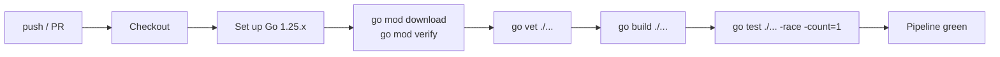

# CI and tests

Every push to `main` and every pull request runs through a CI pipeline that exercises the full Go build and test suite. This page documents what runs, why it runs, and how to reproduce CI failures on your laptop.

## Workflow

The CI pipeline is defined in [`.github/workflows/ci.yml`](https://github.com/darkquasar/fracta/blob/main/.github/workflows/ci.yml). It runs on:

- Every push to `main`
- Every pull request targeting `main`

It does **not** run on tag pushes — those trigger the release workflow instead (see [Releasing](/development/releasing)).

## What runs



Single ubuntu-latest runner. ~3-5 minutes total for a clean cache run; ~1-2 minutes with cache hit.

### Step-by-step

| Step | Command | What it catches |
|---|---|---|
| Tidy check | `go mod download` + `go mod verify` | Drift between `go.mod`, `go.sum`, and module cache. Catches forgotten `go mod tidy` runs. |
| Vet | `go vet ./...` | Static analysis: format-string mismatches, struct-tag errors, copylocks, unreachable code. |
| Build | `go build ./...` | Every package compiles. Catches type errors, missing dependencies. |
| Test | `go test ./... -count=1 -timeout 5m` | Full unit + integration test suite. The `-count=1` flag bypasses Go's test result cache so every run actually re-executes. |

### Known issue: `-race` is currently disabled

The race detector (`go test -race`) is **not enabled** in CI right now. There are two known races that need fixing first:

1. **`internal/host/codex/appserver_test.go`** — a real fracta-owned race. The mock app server's response struct is written from a background goroutine while the test reads it. Fixable with a mutex or channel.
2. **`go-keyring v0.2.8` mock provider** — a third-party race in `github.com/zalando/go-keyring`'s test mock. The mock's in-memory map isn't mutex-protected. Used transitively by `internal/oauth` tests. Not our bug; fix needs to come from upstream or via a library swap.

Once issue 1 is fixed and issue 2 is either upstream-fixed or worked around, `-race` should be re-enabled in `ci.yml`. The flag adds ~2x runtime overhead but catches concurrency bugs that otherwise only surface under production load — worth re-enabling once the noise is gone.

In the meantime, you can run with race detection locally on a per-package basis:

```bash
# Skip the known-racy packages
go test ./... -count=1 -race \
  -skip-dir=internal/host/codex \
  -skip-dir=internal/oauth
```

(`-skip-dir` is illustrative; Go doesn't have that exact flag — use explicit package globs instead.)

## Reproducing CI locally

CI does nothing magic — every step is reproducible on your machine.

### Full pipeline

```bash
# In repo root
go mod download
go mod verify
go vet ./...
go build ./...
go test ./... -race -count=1 -timeout 5m
```

If all five pass, your push will pass CI.

### Just the failing step

When CI fails, the workflow log shows which step. To drill in:

| CI step failed | Local reproduction |
|---|---|
| `go mod verify` | `go mod tidy && git diff go.mod go.sum` — commit any changes |
| `go vet ./...` | `go vet ./...` — fix the reported issues |
| `go build ./...` | `go build ./...` — read the error, fix the type / import |
| `go test ./...` | Drill into the failing package: `go test ./internal/orchestrator/... -run TestSpawnGoldenSubset -v -race` |

### A specific test

```bash
# Just one test function in one package, with full output and race detection
go test ./internal/orchestrator -run TestSpawnGoldenSubset -v -race
```

The `-v` flag prints the names of subtests as they run, useful for narrowing down which assertion failed.

## Test categories

Fracta's tests fall into roughly four groups, all run by `go test ./...`:

| Category | Convention | Example |
|---|---|---|
| **Unit** | `*_test.go` next to source | `internal/contract/parse_test.go` |
| **Integration (in-process)** | `*_integration_test.go` | `internal/registry/reconciler_integration_test.go` |
| **Golden** | `testdata/*.golden.json` checked vs runtime output | `internal/orchestrator/spawn_golden_test.go` |
| **Wire-protocol** | Tests that exercise the full MCP protocol surface | `internal/mcpserver/checkpoint_integration_test.go` |

There's no separate `*_e2e_test.go` flavor — the K8s smoke test (`scripts/k8s-smoke-test.sh`) is the closest thing to a true end-to-end test, but it's a shell script that runs *outside* the Go test runner and isn't part of CI.

## Test data conventions

- **Goldens** live alongside the test in `testdata/<test-name>/<scenario>.golden.<ext>`. Update with `go test ./... -update` (where the test supports an `-update` flag — varies by package).
- **Fixtures** for MCP protocol tests live in `testdata/` directories. Read-only inputs.
- **Temp directories** are created per-test via `t.TempDir()`. Auto-cleanup; never leaked.

## Skipping tests

Some tests require external services (FalkorDB, Postgres, Docker). They use build tags or environment-gated `t.Skip()`:

```go
// Inside a test that needs FalkorDB:
if os.Getenv("FALKORDB_ADDR") == "" {
    t.Skip("FALKORDB_ADDR not set; skipping integration test")
}
```

CI runs **without** these env vars set, so external-service tests skip there. Run them locally with the service exposed:

```bash
# Start FalkorDB locally
docker run --rm -d -p 6379:6379 --name falkordb falkordb/falkordb:latest

# Run the affected tests
FALKORDB_ADDR=localhost:6379 go test ./internal/graph -run TestIntegration -v
```

## Caching

The CI workflow uses `actions/setup-go@v5` with `cache: true`, which caches:

- `~/go/pkg/mod` (downloaded module sources)
- `~/.cache/go-build` (compiled package artifacts)

Cache key is derived from `go.sum` — bumping a dependency invalidates the cache for that PR. Most PRs hit the cache and finish in ~1-2 minutes.

## When CI is green but local is broken

If `go test` fails locally but passes CI, check:

1. **Stale build cache**: `go clean -testcache && go test ./...`
2. **Stale module cache**: `go clean -modcache && go mod download`
3. **Different Go version**: `go version` against `go.mod` declared version
4. **Uncommitted changes**: `git status` — CI runs against the pushed commit, not your working tree
5. **Different OS**: CI runs Linux; some tests behave differently on macOS (e.g. file permission specifics, default temp dir locations)

## When CI is broken but local is green

Less common but worth knowing:

1. **Race detector finds something**: the local run might have been `go test ./...` (no `-race`); CI is `-race`. Try locally with `-race`.
2. **Test depends on env**: a test reads `$HOME` or `$USER` and your local values differ from CI's `runner` user.
3. **Test depends on time/timezone**: CI runs UTC; your machine probably doesn't. Check for hardcoded timezone assumptions.
4. **Flaky test**: re-run the failed CI job. If it passes, the test has a race or timing issue. Open an issue and fix the test rather than retrying.

## Future enhancements

Things not yet in CI that may be added later:

- **Lint** (golangci-lint) — broader static analysis beyond `go vet`. Currently optional locally; not enforced.
- **Coverage reporting** — `go test -coverprofile`, upload to Codecov or similar.
- **Benchmark drift detection** — run `go test -bench` on PRs and compare to baseline.
- **Integration tests against a real FalkorDB / Postgres** — would require service containers in the CI workflow.

These are conscious trade-offs: every additional CI step adds runtime and maintenance burden. The current pipeline catches the vast majority of regressions without becoming the bottleneck.
