# Development

This section covers everything you need to work on fracta itself: building the binary, running the test suite, the CI pipeline that runs on every push, and the release process for cutting tagged versions.

If you're looking to **use** fracta rather than develop it, start with [Getting Started](/getting-started/installation) instead.

## Audience

- **Casual contributors** who want to build from source and verify changes locally before opening a PR.
- **Maintainers** who cut releases, manage CI, and own the build/test infrastructure.
- **Operators** who need reproducible builds for internal deployment.

## Pages in this section

| Page | What it covers |
|---|---|
| [Building from source](/development/building) | Local build, the `make` targets, Go version requirements, embedding a version string |
| [CI and tests](/development/ci-and-tests) | The `ci.yml` workflow, what runs on every push and PR, how to reproduce CI failures locally |
| [Releasing](/development/releasing) | The `release.yml` workflow, semver tag conventions, multi-arch binary + Docker image artifacts |

## Repository layout (relevant to development)

```
fracta/
├── main.go                 # Binary entry point — sets version, calls cmd.Execute()
├── cmd/                    # Cobra command definitions (root, spawn, list, serve, etc.)
├── internal/               # Implementation packages (controlplane, gateway, mcpserver, ...)
│   └── project/scaffolds/templates/{local,docker-compose,k8s}/
│                           # Embedded scaffold sources — what `fracta init --scaffold <mode>` writes
├── mcp-servers/            # Canonical MCP server catalog (spec-43); fetched by `fracta config mcp fetch`
├── strategies/             # Python strategy runner + sample strategies
├── docs/                   # Mintlify documentation site (you're reading this)
├── Dockerfile              # Two-stage build: Go binary + Python sidecar runtime
├── Makefile                # `make build`, `make test`, `make docker-build`, etc.
├── go.mod                  # Go module — declares minimum Go version (1.25+)
└── .github/workflows/      # ci.yml (per-push) and release.yml (per-tag)
```

The old top-level `deployment/` directory was removed in spec-43 Concern L. The Compose stack, K8s manifests, and auth-helper templates moved into the embedded scaffold tree under `internal/project/scaffolds/templates/`; the MCP server catalog moved to `mcp-servers/` at the repo root.

## Quick start

```bash
git clone https://github.com/darkquasar/fracta.git
cd fracta

# Build the binary
make build               # → bin/fracta

# Run the test suite
make test                # → go test ./...

# Run a specific package's tests
go test ./internal/orchestrator/... -count=1 -race
```

For deeper details on each step, follow the pages linked above.

## Development cycle

End-to-end loop from "I have an idea" to "users can `docker pull` it":

```mermaid
flowchart LR
    classDef plan fill:#3A4ACC,stroke:#1e2b8a,color:#fff,stroke-width:2px
    classDef code fill:#059669,stroke:#065f46,color:#fff,stroke-width:1.5px
    classDef ci fill:#5B6CFF,stroke:#3A4ACC,color:#fff,stroke-width:1.5px
    classDef review fill:#8BA0FF,stroke:#5B6CFF,color:#0b1437,stroke-width:1.5px
    classDef decision fill:#b45309,stroke:#7c2d12,color:#fff,stroke-width:2px
    classDef release fill:#475569,stroke:#1e293b,color:#fff,stroke-width:1.5px

    SPEC["Write spec<br/>in fracta-specs/"]:::plan
    BRANCH["Branch from main"]:::code
    CODE["Code + tests"]:::code
    LOCAL["make build<br/>make test"]:::code
    PR["Open PR"]:::ci
    CI["CI: vet + build + test<br/>on push"]:::ci
    REVIEW["Review + merge<br/>to main"]:::review
    CUT{"Cut release?"}:::decision
    TAG["git tag -a vX.Y.Z<br/>git push origin vX.Y.Z"]:::release
    RELEASE["Release workflow:<br/>binaries + ghcr.io image"]:::release

    SPEC --> BRANCH
    BRANCH --> CODE
    CODE --> LOCAL
    LOCAL --> PR
    PR --> CI
    CI --> REVIEW
    REVIEW --> CUT
    CUT -->|no| BRANCH
    CUT -->|yes| TAG
    TAG --> RELEASE
```



Each arrow above is documented in detail:

- **Spec** → see `../fracta-specs/`. Open or claim a number, write `spec.md` and `plan.md`, get review before coding.
- **Code + test loop** → [Building from source](/development/building). Reproducing CI locally → [CI and tests](/development/ci-and-tests).
- **CI** → runs on every push to `main` and every PR. Same page.
- **Cut a release** → [Releasing](/development/releasing) covers the whole tag-and-publish flow.

### When to cut a release

Fracta releases are **feature-driven**, not calendar-driven. The rule of thumb:

- **MAJOR** (`v1.0.0`) — first stable; or a breaking change to the CLI, config schema, or public Go API after `v1`.
- **MINOR** (`v0.X.0`) — new user-facing surface: a new command, a new scaffold mode, a new MCP catalog source form. Examples: `v0.2.0` shipped `fracta config mcp` and spec-42 scaffolds.
- **PATCH** (`v0.X.Y`) — bug fixes, doc improvements, dependency bumps with no behavior change.

Releases are cut from `main`. Don't release from feature branches except for hotfixes against an older `v0.X` line — see [Backports and hotfixes](/development/releasing#backports-and-hotfixes).

### Where the changelog lives

- **GitHub Release notes** — auto-generated from commit messages since the previous tag. This is the primary changelog for end users; it lands automatically on every release.
- **`docs/contributing/changelog.md`** — the editorial changelog. Hand-curated for notable changes worth a longer explanation. Update it for any change that warrants more than a one-line commit subject.

