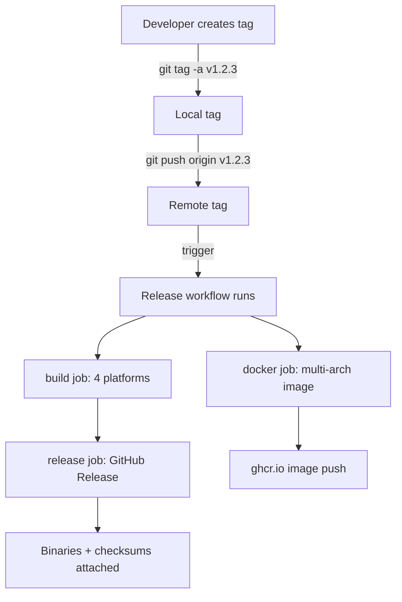

# Releasing

Fracta releases are triggered by pushing a semver-shaped git tag. The release workflow then builds platform binaries, publishes a multi-arch Docker image, and creates a GitHub Release with auto-generated notes.

This page covers the mechanics. For the day-to-day build/test loop, see [Building from source](/development/building) and [CI and tests](/development/ci-and-tests).

## Versioning

Fracta follows [Semantic Versioning 2.0](https://semver.org). Tags are prefixed with `v`:

| Tag pattern | Examples | When to use |
|---|---|---|
| `vMAJOR.MINOR.PATCH` | `v0.1.0`, `v1.2.3` | Stable releases |
| `vMAJOR.MINOR.PATCH-PRERELEASE` | `v0.2.0-rc1`, `v1.0.0-beta.2` | Pre-releases |
| `vMAJOR.MINOR.PATCH-PRERELEASE+METADATA` | `v0.2.0-rc1+sha.abc123` | Pre-release with build metadata |

The release workflow recognises both stable and pre-release tags. Pre-release tags do **not** get the `latest` Docker tag — only stable tags do.

## How a release happens



The workflow is defined in [`.github/workflows/release.yml`](https://github.com/darkquasar/fracta/blob/main/.github/workflows/release.yml).

## Cutting a release

### 1. Make sure CI is green

Releases should be cut from a known-good main. Verify the latest CI run passed:

```bash
gh run list --workflow=ci.yml --limit 5
```

The most recent push to main should show `completed success`.

### 2. Decide the version

For a stable release, bump from the previous tag according to semver rules:

- **MAJOR**: breaking changes (CLI flag removed, public Go API broken, config format changed incompatibly)
- **MINOR**: backwards-compatible feature additions
- **PATCH**: backwards-compatible bug fixes

For pre-releases, append `-rc1` / `-beta.1` / etc.

### 3. Create and push the tag

```bash
# Annotated tag with a message — recommended
git tag -a v0.2.0 -m "v0.2.0 — initial public release"

# Push the tag
git push origin v0.2.0
```

The push triggers the release workflow within seconds.

### 4. Watch the workflow

```bash
# List recent runs
gh run list --workflow=release.yml --limit 5

# Follow the most recent run live
gh run watch
```

A successful run takes ~5-8 minutes:

- Build job: ~2-3 minutes per platform (parallel)
- Docker job: ~3-5 minutes (multi-arch is slower due to QEMU emulation)
- Release job: under a minute (just attaches artifacts)

### 5. Verify the release

After the workflow finishes:

```bash
# View the GitHub Release page
gh release view v0.2.0

# Download a binary to test
gh release download v0.2.0 -p 'fracta-*-darwin-arm64'
chmod +x fracta-v0.2.0-darwin-arm64
./fracta-v0.2.0-darwin-arm64 --version
# → "fracta version v0.2.0"

# Verify the Docker image
docker pull ghcr.io/darkquasar/fracta:v0.2.0
docker run --rm ghcr.io/darkquasar/fracta:v0.2.0 fracta --version
```

## Release artifacts

Each release publishes:

### Platform binaries

Attached to the GitHub Release page:

| File | Platform |
|---|---|
| `fracta-vX.Y.Z-linux-amd64` | Linux x86_64 |
| `fracta-vX.Y.Z-linux-arm64` | Linux ARM64 (Raspberry Pi, AWS Graviton, etc.) |
| `fracta-vX.Y.Z-darwin-amd64` | macOS Intel |
| `fracta-vX.Y.Z-darwin-arm64` | macOS Apple Silicon |

Each binary has a matching `.sha256` checksum file.

Build details (applied uniformly to all four binaries):

- `CGO_ENABLED=0` — static binary, no glibc dependency
- `-trimpath` — reproducible builds, no developer paths leaked
- `-ldflags "-s -w -X main.version=vX.Y.Z"` — strip debug info, embed version

### Docker image

Pushed to GitHub Container Registry (ghcr.io). Multi-arch (linux/amd64 + linux/arm64) — the right architecture is selected automatically when you `docker pull`.

Tags published per release:

- `ghcr.io/darkquasar/fracta:vX.Y.Z` — exact version
- `ghcr.io/darkquasar/fracta:X.Y.Z` — without the `v` prefix
- `ghcr.io/darkquasar/fracta:X.Y` — minor-version alias (auto-bumped)
- `ghcr.io/darkquasar/fracta:X` — major-version alias (auto-bumped)
- `ghcr.io/darkquasar/fracta:latest` — only for stable releases (no pre-release tag)

Pre-release tags (e.g. `v0.2.0-rc1`) skip `latest` so consumers pulling `latest` always get a stable version.

### GitHub Release notes

Auto-generated from commit history since the previous tag. Includes:

- List of merged PRs with author attribution
- Categorised changes (if you use conventional commit prefixes like `feat:`, `fix:`, `docs:`)
- Comparison link to the previous release

You can edit the release notes manually after the workflow finishes via `gh release edit vX.Y.Z`.

## What to do if a release fails

### Build job failed

Most likely a platform-specific issue (CGO accidentally re-enabled, syscall import that doesn't exist on darwin, etc.). Check the workflow log for the failing platform:

```bash
gh run view --log
```

Fix the issue on `main`, delete the broken tag, re-tag:

```bash
# Locally
git tag -d v0.2.0

# Remotely
git push --delete origin v0.2.0

# Once main has the fix
git tag -a v0.2.0 -m "v0.2.0"
git push origin v0.2.0
```

### Release job failed (artifacts didn't attach)

Usually a permissions issue (`contents: write` not set) or a transient GitHub API error. The build job already produced the binaries — they're in the workflow run artifacts. Re-run just the failed job:

```bash
gh run rerun <run-id> --failed
```

### Docker job failed

Most common cause: ghcr.io permissions. Confirm the workflow has `packages: write` permission and that the repository's "Manage Actions access" allows GITHUB_TOKEN to write packages.

If the binary release succeeded but Docker didn't, you can re-trigger just the Docker job:

```bash
gh workflow run release.yml --ref v0.2.0
```

(Note: the workflow only triggers on tag *push*, not on `workflow_dispatch` by default. To enable manual re-runs, add `workflow_dispatch:` under `on:` in the workflow file.)

## Backports and hotfixes

For a critical bug in v0.2.0 that needs a v0.2.1 release while v0.3.0 work continues on main:

1. Branch from the v0.2.0 tag: `git checkout -b release/v0.2 v0.2.0`
2. Cherry-pick the fix from main: `git cherry-pick FIX_SHA`
3. Push the branch: `git push origin release/v0.2`
4. Tag from the branch: `git tag -a v0.2.1 -m "v0.2.1 — fix X" && git push origin v0.2.1`

The CI workflow runs against the branch push; the release workflow runs against the tag.

## Quick reference card

The whole release flow boiled down to copy-pasteable commands. Useful when you've done it before and just need a refresher.

### Cut a stable release

```bash
# 1. Verify CI is green on the most recent push to main
gh run list --workflow=ci.yml --limit 5

# 2. Tag and push (replace v0.1.0 with your version)
git tag -a v0.1.0 -m "v0.1.0"
git push origin v0.1.0

# 3. Watch the release workflow run (~5–8 min)
gh run watch

# 4. Verify the GitHub Release
gh release view v0.1.0

# 5. Verify the Docker image
docker pull ghcr.io/darkquasar/fracta:v0.1.0
docker run --rm ghcr.io/darkquasar/fracta:v0.1.0 fracta --version
```

### Cut a pre-release

Same flow, but use a pre-release tag (`-rc1`, `-beta.1`, etc.). Pre-releases skip the `latest` Docker tag.

```bash
git tag -a v0.2.0-rc1 -m "v0.2.0-rc1"
git push origin v0.2.0-rc1
gh run watch
```

### Inspect / debug

```bash
# List recent runs of the release workflow
gh run list --workflow=release.yml --limit 5

# View a specific run's full log
gh run view <run-id> --log

# View only the failed steps' logs
gh run view <run-id> --log-failed

# Re-run only the failed jobs (faster than full rerun)
gh run rerun <run-id> --failed

# Cancel a stuck run
gh run cancel <run-id>
```

### Recover from a botched release

```bash
# Delete the local tag
git tag -d v0.1.0

# Delete the remote tag
git push --delete origin v0.1.0

# Delete the GitHub Release (if one was published)
gh release delete v0.1.0 --yes

# Once main has the fix, re-tag with the same version
git tag -a v0.1.0 -m "v0.1.0"
git push origin v0.1.0
```

### Download a published binary to test

```bash
# All artifacts for a release
gh release download v0.1.0

# Just one platform
gh release download v0.1.0 -p 'fracta-*-darwin-arm64'

# Verify the checksum
shasum -a 256 -c fracta-v0.1.0-darwin-arm64.sha256
```

---

## Yanking a release

GitHub Releases can be deleted, but tags persist in the repo's history and in any clones. To "yank" a release:

```bash
# Delete the release (artifacts go away)
gh release delete v0.2.0 --yes

# Optionally delete the tag (won't remove from existing clones)
git push --delete origin v0.2.0
git tag -d v0.2.0
```

For Docker images, manually delete via the GitHub Packages UI or `gh api`:

```bash
gh api -X DELETE /user/packages/container/fracta/versions/<version-id>
```

A yanked release should be replaced with a clear changelog entry explaining why and what to use instead.

## Future enhancements

Things not yet in the release workflow that may be added later:

- **Homebrew tap** — auto-update a Homebrew formula on release.
- **Code signing** — sign macOS binaries (requires Apple Developer ID + secrets management).
- **SBOM generation** — produce a Software Bill of Materials per release for supply-chain transparency.
- **Reproducible builds verification** — a separate job that rebuilds and confirms binary hash equality.

These are deferred until they're actually needed — premature complexity in release tooling is a long-term cost.
