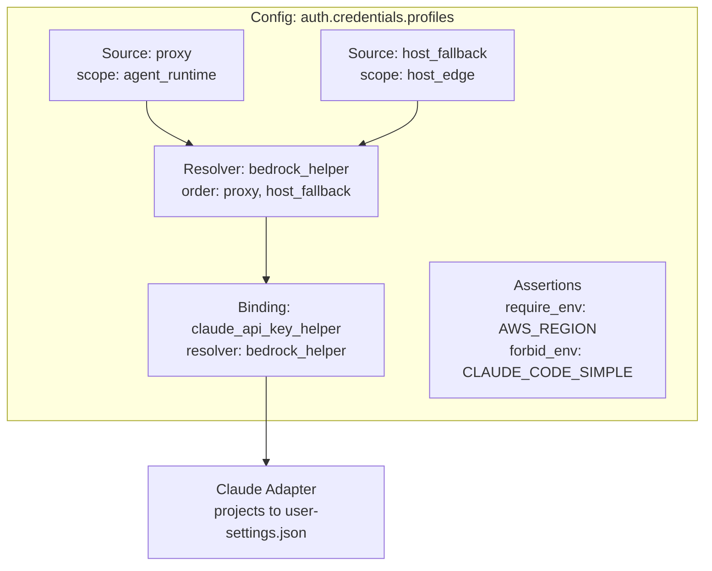
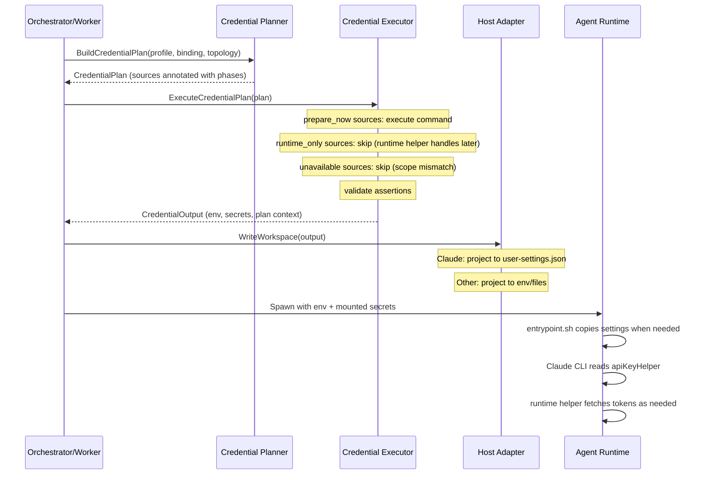
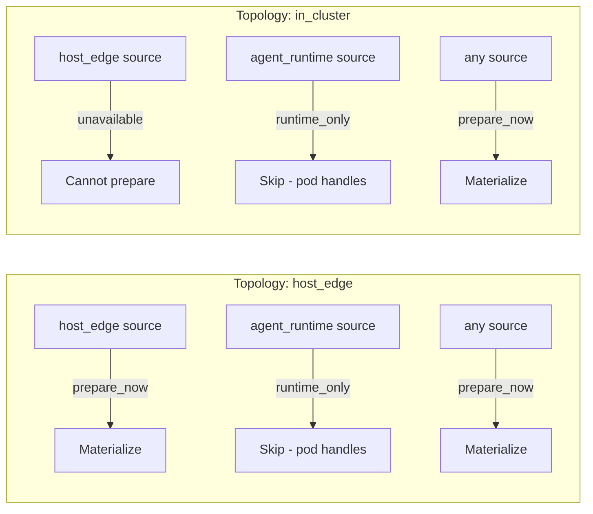
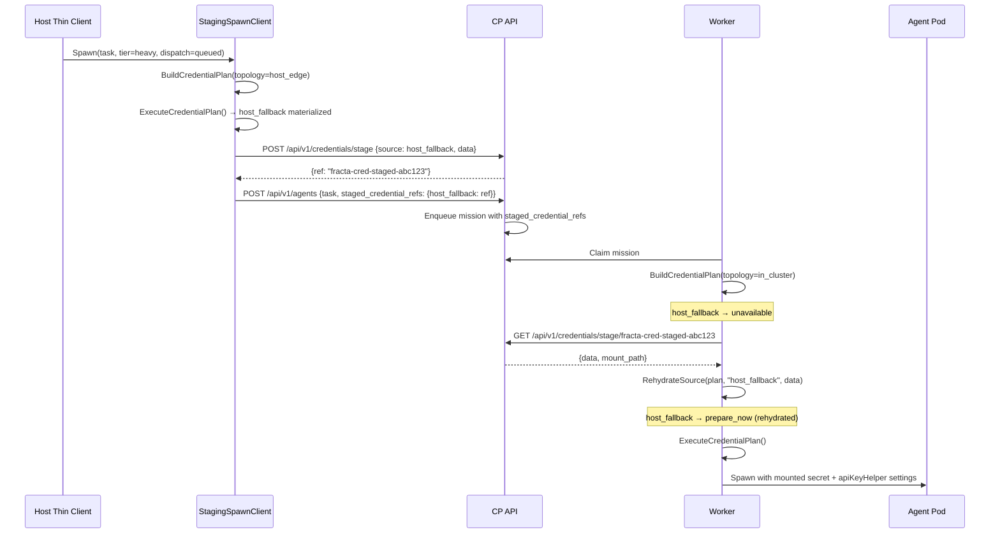

# Credential Pipeline

This is the canonical reference for  Fracta auth configuration.

The credential pipeline handles authentication for both local-process agents and K8s agents. It uses a three-layer model:

- **sources**: named credential origins under `auth_origins`
- **resolvers**: runtime helper commands under `runtime_auth_resolvers`
- **bindings**: delivery rules that tell a host adapter how to consume credentials

The names are easy to read as peers, but they are not peers in time:

| Layer | Main question | Runs where | Common local-process shape |
|-------|---------------|------------|-----------------------------|
| `sources` | "What credential origin exists?" | Orchestrator before spawn, or agent runtime depending on scope | Often omitted entirely |
| `resolvers` | "What helper command should the adapter call later?" | Inside the agent environment at runtime | `bedrock-auth-helper` |
| `bindings` | "How does this adapter expect to receive auth?" | Adapter projection / spawn wiring | `claude_api_key_helper` or `bearer_env` |

## At a Glance

### Where config lives

`fracta.yaml` has two auth layers:

| Location | Purpose | Typical contents |
|----------|---------|------------------|
| `auth.credentials.profiles.<name>` | Reusable credential profile | `auth_origins`, `runtime_auth_resolvers`, `env`, `assertions`, `default_binding` |
| `agents.agent_runtimes.<name>` | Runtime entry that selects a profile | `adapter`, `auth_profile`, optional `auth_binding` override |

Typical flow:

1. Define a reusable profile under `auth.credentials.profiles`.
2. Point a runtime at it with `auth_profile`.
3. Override `auth_binding` on the runtime only when the same profile needs a different delivery shape for a different adapter.

### How to read the names

Auth config mixes three different kinds of names:

| Kind | What it is | Examples | Who interprets it |
|------|------------|----------|-------------------|
| Schema keywords | Fixed field names and enum values from Fracta's config schema | `auth_profile`, `auth_origins`, `default_binding`, `secret_env`, `bearer_env`, `secret_ref` |  Fracta |
| Local labels | User-defined identifiers that other fields in the same config refer to | `opencode_bedrock`, `seeded_token`, `bedrock_helper` | Fracta, by matching references |
| External names | Names that must match real env vars, K8s Secrets, Secret keys, or runtime-specific variables | `AWS_BEARER_TOKEN_BEDROCK`, `AWS_REGION`, `fracta-auth`, `bearer-token` | Kubernetes, the runtime, or both |

Reference fields are what connect the local labels:

| Field | Refers to |
|-------|-----------|
| `auth_profile` | A profile name under `auth.credentials.profiles.<name>` |
| `auth_origin` | A source name under `auth_origins.<name>` |
| `runtime_auth_resolver` | A resolver name under `runtime_auth_resolvers.<name>` |

ASCII relationship diagram:

```text
SCHEMA KEYWORDS / ENUMS
  agents.agent_runtimes
  auth_profile
  auth_origins
  default_binding
  auth_origin
  type: secret_env
  type: bearer_env
  secret_ref

LOCAL LABELS (defined here, then referenced elsewhere)
  opencode_bedrock
  seeded_token

EXTERNAL NAMES (must match real runtime/K8s objects)
  AWS_BEARER_TOKEN_BEDROCK
  AWS_REGION
  fracta-auth
  bearer-token

RELATIONSHIPS

  agents.agent_runtimes.opencode.auth_profile
      |
      v
  profiles.opencode_bedrock
      |
      +--> auth_origins.seeded_token
      |         |
      |         +--> type: secret_env
      |         +--> env_name: AWS_BEARER_TOKEN_BEDROCK
      |         \--> secret_ref.name/key
      |                |
      |                +--> fracta-auth
      |                \--> bearer-token
      |
      \--> default_binding
                |
                +--> type: bearer_env
                +--> auth_origin: seeded_token
                \--> env_name: AWS_BEARER_TOKEN_BEDROCK

RESULT
   Fracta resolves local labels (`opencode_bedrock`, `seeded_token`)
  and projects the external token into the runtime env var
  `AWS_BEARER_TOKEN_BEDROCK`.
```

Annotated example:

```yaml
agents:
  agent_runtimes:
    opencode:
      adapter: opencode                    # schema value
      auth_profile: opencode_bedrock      # local label -> profile name below

auth:
  credentials:
    profiles:
      opencode_bedrock:                   # local label
        auth_origins:
          seeded_token:                   # local label
            type: secret_env              # schema enum
            scope: any                    # schema enum
            env_name: AWS_BEARER_TOKEN_BEDROCK   # external env var name
            secret_ref:                   # schema field
              name: fracta-auth             # external K8s Secret name
              key: bearer-token           # external key inside that Secret
        env:
          AWS_REGION: "ap-southeast-2"    # external env var name
        default_binding:
          type: bearer_env                # schema enum
          auth_origin: seeded_token       # local label -> source name above
          env_name: AWS_BEARER_TOKEN_BEDROCK   # external env var name
```

Practical rule:

- If changing the name requires changing a matching reference elsewhere in `fracta.yaml`, it is probably a local label.
- If changing the name requires changing a real Secret, env var, or runtime expectation outside `fracta.yaml`, it is probably an external name.
- If the name comes from the config schema itself, it is a schema keyword and should not be renamed.

### Binding types

Bindings answer: "how do credentials reach the runtime?"

| Binding Type | How it works | Typical use case | Notes |
|--------------|--------------|------------------|-------|
| `claude_api_key_helper` | Writes Claude's `apiKeyHelper` setting plus env into `user-settings.json` | Claude + Bedrock bearer tokens with refresh/TTL | Claude-specific projection |
| `bearer_env` | Injects a token directly as an env var | OpenAI API keys, Anthropic direct keys, Bedrock bearer env vars | Supports source-based, resolver-based, or env passthrough shapes |
| `token_file` | Mounts credential data as a file | K8s file-mounted secrets | Uses a materialized source with a configured `path` |

### Credential source types

Sources answer: "where does the credential come from?"

| Source Type | What it does | Common scope | Typical use case |
|-------------|--------------|--------------|------------------|
| `http_header_token` | Makes an HTTP request and extracts a token from a response header | `agent_runtime` | Bedrock/corporate proxy token fetch |
| `command_output` | Runs a local command and uses stdout as the credential | `host_edge` or `any` | `bedrock-auth-helper` for host-side or local-process token fetch. Use `scope: any` for local-process mode so the token materializes at spawn time in all topologies. The `command` field **must** be a YAML array (e.g. `["bedrock-auth-helper"]`), not a string. |
| `secret_env` | References a pre-existing K8s Secret key as an env var | `any` | Static API keys in Kubernetes |

### Quick examples

Claude with refreshable Bedrock auth:

```yaml
auth:
  credentials:
    profiles:
      bedrock:
        runtime_auth_resolvers:
          bedrock_token:
            type: command
            command: bedrock-auth-helper
            ttl_ms: 60000
        env:
          CLAUDE_CODE_USE_BEDROCK: "1"
          CLAUDE_CODE_SKIP_BEDROCK_AUTH: "1"
          AWS_REGION: "ap-southeast-2"
        default_binding:
          type: claude_api_key_helper
          runtime_auth_resolver: bedrock_token

agents:
  agent_runtimes:
    claude:
      adapter: claude
      auth_profile: bedrock
```

Codex or OpenAI-style direct API key:

```yaml
auth:
  credentials:
    profiles:
      openai:
        env:
          OPENAI_API_KEY: "${OPENAI_API_KEY}"
        default_binding:
          type: bearer_env
          env_name: OPENAI_API_KEY

agents:
  agent_runtimes:
    codex:
      adapter: codex
      auth_profile: openai
```

K8s Secret-backed API key:

```yaml
auth:
  credentials:
    profiles:
      openai_secret:
        auth_origins:
          api_key:
            type: secret_env
            scope: any
            env_name: OPENAI_API_KEY
            secret_ref:
              name: openai-api
              key: api-key
        default_binding:
          type: bearer_env
          auth_origin: api_key
          env_name: OPENAI_API_KEY
```

## Architecture



## Three Layers

### Sources

Sources describe credential origins. In YAML, they live under `auth_origins`. Each source has a **scope** that determines when it is available:

| Scope | Meaning | Example |
|-------|---------|---------|
| `agent_runtime` | Only available to the agent/runtime helper after spawn | corporate proxy HEAD request |
| `host_edge` | Prepared on the host before spawning | `bedrock-auth-helper` in host-orchestrated K8s |
| `any` | Available in any topology | Pre-existing K8s Secret |

Source types:

| Type | Description | Important fields |
|------|-------------|------------------|
| `http_header_token` | Extract token from an HTTP response header | `request`, `extract`, `scope` |
| `command_output` | Run a command and use stdout as the credential | `command`, `scope`, optional `delivery`, optional `path` |
| `secret_env` | Reference a pre-existing K8s Secret | `env_name`, `secret_ref`, `scope` |

### Resolvers

A resolver is a runtime helper command. The primary example is `fetch-bedrock-token`:

1. Try corporate proxy HEAD request (source: `proxy`)
2. If that fails, read mounted fallback file (source: `host_fallback`)

In local-process mode, a resolver can also stand alone with no `sources` block at all. Example: Claude can call `bedrock-auth-helper` directly as its `apiKeyHelper`.

`order` is deprecated. If a helper command needs fallback logic, the command should own it internally rather than duplicating it in config.

### Bindings

Bindings describe how a host adapter consumes credentials:

| Binding Type | Adapter Action | Required fields |
|-------------|----------------|-----------------|
| `claude_api_key_helper` | Write `apiKeyHelper` to `~/.claude/settings.json` (Claude) | `runtime_auth_resolver` |
| `bearer_env` | Inject token as environment variable | `env_name`, plus optionally `auth_origin` or `runtime_auth_resolver` |
| `token_file` | Mount token as a file | `auth_origin` |

`bearer_env` has three valid shapes:

1. `source + env_name`: inject a materialized source into an env var
2. `resolver + env_name`: inject the first materialized source that the helper uses
3. `env_name` only: plain env passthrough, where the value already exists in host/profile env

## Execution Flow



## Source Phase Annotation

When the planner builds a credential plan, each source is annotated with an **execution phase** based on its scope and the current topology:



| Scope / Topology | `host_edge` | `in_cluster` |
|-----------------|-------------|-------------|
| `host_edge` | prepare_now | unavailable |
| `agent_runtime` | runtime_only | runtime_only |
| `any` | prepare_now | prepare_now |

## Cross-Boundary Staging

When the orchestrator runs in-cluster (Topology B), host-edge credentials must be staged across the CP API boundary:



### Staging Rules

| Scenario | Result |
|----------|--------|
| Remote + `dispatch=queued` + staging needed | Stage via CP API, attach refs |
| Remote + `dispatch=direct` + staging needed | **Error**: requires queued |
| Remote + `mode=stream` + staging needed | **Error**: stream incompatible |
| Remote + dispatch omitted + staging needed | **Error**: requires explicit queued |
| Remote + no staging needed | Pass through |
| Local + direct | Orchestrator handles in-process |
| Local + queued + required host_edge | **Error**: use direct or remote mode |

## Config Reference

### Minimal local-process profile (Claude on host)

```yaml
auth:
  credentials:
    profiles:
      bedrock:
        # No auth_origins: nothing needs pre-materialization in local mode.
        runtime_auth_resolvers:
          bedrock_token:
            type: command
            command: bedrock-auth-helper
            ttl_ms: 60000
        env:
          CLAUDE_CODE_USE_BEDROCK: "1"
          CLAUDE_CODE_SKIP_BEDROCK_AUTH: "1"
          AWS_REGION: "ap-southeast-2"
        assertions:
          require_env: [AWS_REGION]
        default_binding:
          type: claude_api_key_helper
          runtime_auth_resolver: bedrock_token
```

### Env passthrough profile (OpenAI/Codex-style)

```yaml
auth:
  credentials:
    profiles:
      openai:
        assertions:
          require_env: [OPENAI_API_KEY]
        default_binding:
          type: bearer_env
          env_name: OPENAI_API_KEY
```

This binding does not need a `source` or `resolver`. It simply states that the adapter expects `OPENAI_API_KEY` to already be present in the merged env.

### Full credential profile (K8s host-orchestrator)

```yaml
auth:
  credentials:
    profiles:
      bedrock:
        auth_origins:
          proxy:
            type: http_header_token
            scope: agent_runtime
            request:
              method: HEAD
              url: https://ai-developer-tooling-llm-proxy-bedrock-runtime.platform.corp-internal.example.com
              headers:
                X-AWS-Region: "${AWS_REGION}"
            extract:
              header: x-bedrock-token
          host_fallback:
            type: command_output
            scope: host_edge
            command: ["bedrock-auth-helper"]
            delivery: file_mount
            path: /var/run/fracta-auth/bedrock-token
            required: false
        runtime_auth_resolvers:
          bedrock_helper:
            type: command
            command: /usr/local/bin/fetch-bedrock-token
            ttl_ms: 60000
            # Deprecated: kept only for backward compatibility.
            order: [proxy, host_fallback]
        env:
          CLAUDE_CODE_USE_BEDROCK: "1"
          CLAUDE_CODE_SKIP_BEDROCK_AUTH: "1"
          AWS_REGION: "ap-southeast-2"
        assertions:
          require_env: [AWS_REGION]
          forbid_env: [CLAUDE_CODE_SIMPLE]
        default_binding:
          type: claude_api_key_helper
          runtime_auth_resolver: bedrock_helper
```

### In-cluster profile (no host_fallback — pods self-auth via the credentials proxy)

```yaml
auth:
  credentials:
    profiles:
      bedrock:
        auth_origins:
          proxy:
            type: http_header_token
            scope: agent_runtime
            request:
              method: HEAD
              url: https://ai-developer-tooling-llm-proxy-bedrock-runtime.platform.corp-internal.example.com
              headers:
                X-AWS-Region: "${AWS_REGION}"
            extract:
              header: x-bedrock-token
        runtime_auth_resolvers:
          bedrock_helper:
            type: command
            command: /usr/local/bin/fetch-bedrock-token
            ttl_ms: 60000
            # Deprecated: kept only for backward compatibility.
            order: [proxy]
        env:
          CLAUDE_CODE_USE_BEDROCK: "1"
          CLAUDE_CODE_SKIP_BEDROCK_AUTH: "1"
          AWS_REGION: "ap-southeast-2"
        assertions:
          require_env: [AWS_REGION]
          forbid_env: [CLAUDE_CODE_SIMPLE]
        default_binding:
          type: claude_api_key_helper
          runtime_auth_resolver: bedrock_helper
```

### Host binding override (non-Claude adapter)

```yaml
hosts:
  future_host:
    adapter: future
    auth_profile: bedrock
    auth_binding:
      type: bearer_env
      auth_origin: host_fallback
      env_name: FUTURE_API_TOKEN
```

### `order` Deprecation

`resolvers.<name>.order` is deprecated.

Use this rule going forward:

- If the helper is an opaque command, fallback order belongs inside the command.
- New configs should omit `order`.
- Existing configs may keep `order` temporarily for backward compatibility.

## Assertions

Assertions are declarative config-driven validation rules. They run against the **final merged environment** (host env + profile env + binding-derived env) before credentials are materialized. No Claude/Bedrock-specific logic is hardcoded in Go.

| Assertion | Meaning |
|-----------|---------|
| `require_env: [KEY]` | Fail if `KEY` is not in the merged env |
| `forbid_env: [KEY]` | Fail if `KEY` IS in the merged env |
| `require_source: [name]` | Fail if the named source is not available for the topology |
| `warn_if_missing_env: [KEY]` | Warn (non-fatal) if `KEY` is missing |

## Diagnostics

### `fracta auth diagnose`

```bash
fracta auth diagnose --host-type claude --config path/to/fracta.yaml
```

Runs the credential pipeline in dry-run mode and prints:
- Credential origins with scope and execution phase
- Runtime helper command, TTL, and deprecated source order when present
- Binding type and target
- Assertion results (pass/fail)
- Final merged environment variables

### Pod helper debug mode

Set `FRACTA_CREDENTIALS_DEBUG=1` in the credential profile env to enable verbose stderr logging in `fetch-bedrock-token`:

```
[credentials.helper] trying proxy HEAD url=... region=ap-southeast-2
[credentials.helper] proxy: status=ok token_present=true
```

### Structured log events

All credential operations emit structured logs via `fractalog.Component("credentials")`:

| Event | When |
|-------|------|
| `credentials.plan.build` | Plan construction starts |
| `credentials.plan.source` | Each source annotated with phase |
| `credentials.plan.complete` | Plan ready with phase counts |
| `credentials.source.prepare` | Host-edge source being materialized |
| `credentials.source.success` / `.fail` | Source preparation result |
| `credentials.assertion.pass` / `.fail` | Assertion evaluation |
| `credentials.stage.success` / `.fail` | Cross-boundary staging |
| `credentials.rehydrate.success` / `.fail` | Worker rehydration |
| `credentials.binding.project` | Adapter projection |
| `credentials.spawn.materialized` | Final spawn handoff |

## Config File Locations

| File | Mode | Description |
|------|------|-------------|
| `deployment/local-process/fracta.yaml` | Local | Host-local agents, `bedrock-auth-helper` available |
| `deployment/docker-compose/client/fracta.yaml` | Docker Compose | Thin client, CP in compose stack |
| `deployment/k8s-local-cluster/client/fracta.yaml` | Local K8s | Thin client, CP in cluster |
| `deployment/k8s-local-cluster/manifests/fracta-controlplane.yaml` | K8s In-Cluster | Controlplane ConfigMap + Deployment |

## Known Limitations

- ~~`auth_profile` nested under `kubernetes`~~ — **Fixed**: `auth_profile` and `auth_binding` now live at `agents.agent_runtimes.<name>.*` directly, not under `agents.agent_runtimes.<name>.kubernetes.*`.
- `K8sCredentialStager` is not yet implemented — staging uses `InMemoryCredentialStager` (same-process) or `RemoteCredentialStager` (CP API HTTP). A K8s Secret-backed stager would be needed for multi-process production deployments without a CP API.
- No end-to-end integration test covering the full remote staging → CP API → worker rehydration path.
