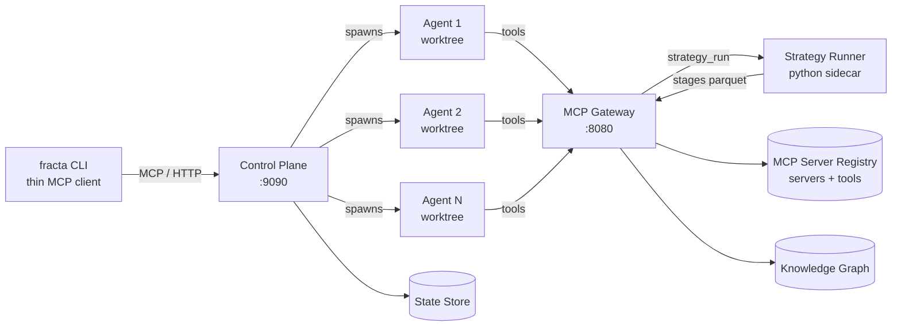

## Control Plane

The control plane is the orchestrator. It listens on port 9090, exposes an HTTP API and an MCP server, and is responsible for spawning agents, admission control, lifecycle tracking, and reaping. See [Swarm → Control Plane](/swarm/control-plane) for the full breakdown.

## MCP Gateway

The MCP Gateway is the tool aggregator. It listens on port 8080 and speaks MCP. Agents call it via MCP; it proxies their tool calls to backend MCP servers (Elasticsearch, Snowflake, Notion, custom APIs) listed in the **MCP server registry**.

The gateway also maintains the **knowledge graph** — a FalkorDB-backed store of domain sources, data stores, MCP servers, tools, and entities discovered during investigations.

Note: the thin `fracta` CLI does **not** connect to the MCP Gateway. The CLI is a control-plane client only; agents are the ones that talk to the gateway, since they're the ones doing the work.

### Namespaced tool calls

When a backend MCP server registers, the gateway exposes its tools under the server's name. Each tool is callable as `<server>.<tool>`:

```
elastic.search_logs(query="error", since="-1h")
vendor.list_alerts(severity="high")
notion.get_page(id="...")
fracta_spawn(task="my-task", contract="...")
```

The `fracta_*` tools are first-party (lifecycle: spawn, list, peek, say, kill, send, inbox). Backend tools are everything else, namespaced by the server registration in [`mcp-servers/catalog.yaml`](https://github.com/darkquasar/fracta/blob/main/mcp-servers/catalog.yaml).

**Source:**
- Gateway: [`internal/gateway/`](https://github.com/darkquasar/fracta/blob/main/internal/gateway)
- MCP server surface: [`internal/mcpserver/`](https://github.com/darkquasar/fracta/blob/main/internal/mcpserver)
- Backend MCP client pool: [`internal/mcpclient/`](https://github.com/darkquasar/fracta/blob/main/internal/mcpclient)

## Strategy Runner

The strategy runner is a long-lived Python sidecar that executes deterministic analytics on behalf of agents. The gateway exposes it as the `strategy_run` MCP tool: an agent calls `strategy_run(name="...", params={...})`, the gateway forwards to the runner over a Unix socket, the runner executes the strategy DAG, and the gateway returns structured results to the agent.

This is the layer that keeps deterministic work — counting, joining, filtering, correlating, ranking — out of the LLM's context window. The agent reasons about *results*, not raw rows.

A strategy is a directory under `strategies/<category>/<slug>/` containing:

- `contract.yaml` — declared inputs (parameters, required tables, columns, types)
- `strategy.py` — the DAG of steps, written against the `fracta_strategies` SDK
- `binding.yaml` (optional) — declares which MCP tool fetches each input table and how

When invoked, the runner:

1. Reads the contract to validate parameters and discover required tables.
2. If a binding exists, calls the named MCP tool (e.g. `elastic.search_logs`) and stages the response into a Parquet table.
3. Loads the Parquet tables into an in-process DuckDB instance.
4. Executes the strategy's `@step`-decorated methods in dependency order.
5. Returns the final result to the agent.

DAG categories shipped today: `hunt`, `detection`, `enrichment`, `correlation`, `traversal`. Strategies can call other strategies by name — useful for layering enrichment on top of correlation, for example.

**Source:**
- Strategy package: [`strategies/`](https://github.com/darkquasar/fracta/blob/main/strategies)
- Runner entry: [`strategies/runner.py`](https://github.com/darkquasar/fracta/blob/main/strategies/runner.py)
- SDK: [`strategies/fracta_strategies/`](https://github.com/darkquasar/fracta/blob/main/strategies/fracta_strategies)
- Strategy engine in fracta: [`internal/strategy/`](https://github.com/darkquasar/fracta/blob/main/internal/strategy)

## Agent Workspaces and Coordination

Each agent runs in its own per-agent workspace — a git worktree in local-process mode, a per-agent directory in containerized modes — and coordinates with peers through a shared mailbox, declared intent, and non-disruptive peeks. The full treatment lives under the Swarm section:

- [Workspaces](/swarm/workspaces) — git worktrees vs directory workspaces, and which capabilities (notably `fracta merge`) light up in which mode
- [Coordination](/swarm/coordination) — mailbox, intent, peek, the inbox rhythm, and how dependent work is handed off

## State, Registry, and Knowledge Graph

| Store | Purpose | Backend |
|---|---|---|
| State Store | Agent state, status, output, intent, resume tokens | SQLite or PostgreSQL |
| MCP Server Registry | Registered MCP servers (transport, connection config, secret refs, status) and their discovered tools (with per-tool enable/disable flags) | SQLite or PostgreSQL |
| Knowledge Graph | Discovered entities and relationships | FalkorDB (Redis-based) |

All three are switchable per deployment mode. Local-process mode uses SQLite + embedded FalkorDB; production deployments use PostgreSQL + a managed FalkorDB.

## What's next

<Card title="Swarm" href="/swarm/overview">
  How agents are spawned, where they live, and how they coordinate.
</Card>

<Card title="Strategies" href="/strategies/overview">
  Deterministic Python pipelines that run against staged data and the graph.
</Card>

<Card title="Deployment Modes" href="/guides/deployment/overview">
  Choose how fracta runs: local, docker-compose, or kubernetes.
</Card>

<Card title="Glossary" href="/introduction/glossary">
  The vocabulary you'll see throughout the docs.
</Card>
