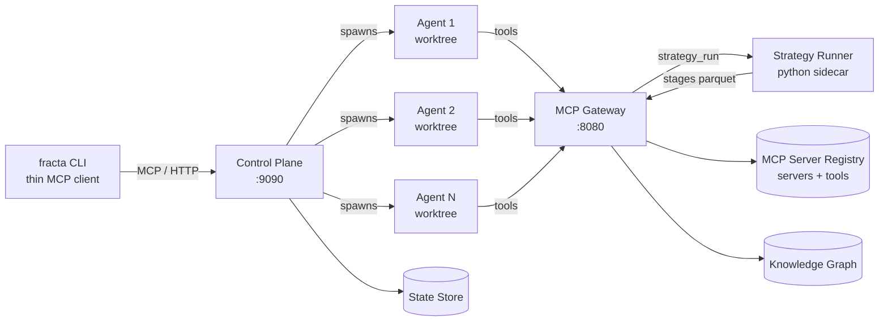

# Architecture

Fracta runs as four cooperating processes, plus one git worktree per active agent.



## Control Plane

The control plane is the orchestrator. It listens on port 9090 and exposes an HTTP API plus an MCP server. Its responsibilities:

- **Spawning agents**: creates a worktree, materializes credential profiles, and launches the runtime CLI as a subprocess (or k8s Job, depending on the deployment mode).
- **Admission control**: enforces concurrency limits and queue eligibility.
- **Lifecycle**: tracks state transitions (queued → running → completed / failed / stopped).
- **Reaping**: cleans up dead worktrees and expired sessions.

**Source:**
- CLI entry: [`cmd/controlplane.go`](https://github.com/darkquasar/fracta/blob/main/cmd/controlplane.go)
- Implementation: [`internal/controlplane/`](https://github.com/darkquasar/fracta/blob/main/internal/controlplane)
- HTTP API handlers: [`internal/cpapi/`](https://github.com/darkquasar/fracta/blob/main/internal/cpapi)
- Orchestrator core: [`internal/orchestrator/orchestrator.go`](https://github.com/darkquasar/fracta/blob/main/internal/orchestrator/orchestrator.go)
- Admission and reaping: [`internal/admission/`](https://github.com/darkquasar/fracta/blob/main/internal/admission), [`internal/agentlifecycle/`](https://github.com/darkquasar/fracta/blob/main/internal/agentlifecycle)

## MCP Gateway

The MCP Gateway is the tool aggregator. It listens on port 8080 and speaks MCP. Agents call it via MCP; it proxies their tool calls to backend MCP servers (Elasticsearch, Snowflake, Notion, custom APIs) listed in the **MCP server registry**.

The gateway also maintains the **knowledge graph** — a FalkorDB-backed store of domain sources, data stores, MCP servers, tools, and entities discovered during investigations.

Note: the thin `fracta` CLI does **not** connect to the MCP Gateway. The CLI is a control-plane client only; agents are the ones that talk to the gateway, since they're the ones doing the work.

### Namespaced tool calls

When a backend MCP server registers, the gateway exposes its tools under the server's name. Each tool is callable as `<server>.<tool>`:

```
elastic.search_logs(query="error", since="-1h")
vendor.list_alerts(severity="high")
notion.get_page(id="...")
fracta_spawn(task="my-task", contract="...")
```

The `fracta_*` tools are first-party (lifecycle: spawn, list, peek, say, kill, send, inbox). Backend tools are everything else, namespaced by the server registration in [`deployment/mcp-servers/catalog.yaml`](https://github.com/darkquasar/fracta/blob/main/deployment/mcp-servers/catalog.yaml).

**Source:**
- Gateway: [`internal/gateway/`](https://github.com/darkquasar/fracta/blob/main/internal/gateway)
- MCP server surface: [`internal/mcpserver/`](https://github.com/darkquasar/fracta/blob/main/internal/mcpserver)
- Backend MCP client pool: [`internal/mcpclient/`](https://github.com/darkquasar/fracta/blob/main/internal/mcpclient)

## Strategy Runner

The strategy runner is a long-lived Python sidecar that executes deterministic analytics on behalf of agents. The gateway exposes it as the `strategy_run` MCP tool: an agent calls `strategy_run(name="...", params={...})`, the gateway forwards to the runner over a Unix socket, the runner executes the strategy DAG, and the gateway returns structured results to the agent.

This is the layer that keeps deterministic work — counting, joining, filtering, correlating, ranking — out of the LLM's context window. The agent reasons about *results*, not raw rows.

A strategy is a directory under `strategies/<category>/<slug>/` containing:

- `contract.yaml` — declared inputs (parameters, required tables, columns, types)
- `strategy.py` — the DAG of steps, written against the `fracta_strategies` SDK
- `binding.yaml` (optional) — declares which MCP tool fetches each input table and how

When invoked, the runner:

1. Reads the contract to validate parameters and discover required tables.
2. If a binding exists, calls the named MCP tool (e.g. `elastic.search_logs`) and stages the response into a Parquet table.
3. Loads the Parquet tables into an in-process DuckDB instance.
4. Executes the strategy's `@step`-decorated methods in dependency order.
5. Returns the final result to the agent.

DAG categories shipped today: `hunt`, `detection`, `enrichment`, `correlation`, `traversal`. Strategies can call other strategies by name — useful for layering enrichment on top of correlation, for example.

**Source:**
- Strategy package: [`strategies/`](https://github.com/darkquasar/fracta/blob/main/strategies)
- Runner entry: [`strategies/runner.py`](https://github.com/darkquasar/fracta/blob/main/strategies/runner.py)
- SDK: [`strategies/fracta_strategies/`](https://github.com/darkquasar/fracta/blob/main/strategies/fracta_strategies)
- Strategy engine in fracta: [`internal/strategy/`](https://github.com/darkquasar/fracta/blob/main/internal/strategy)

## Agent Workspaces

Each agent runs in its own per-agent workspace. The shape of that workspace depends on the deployment mode:

| Mode | Workspace type | Path | Git semantics |
|---|---|---|---|
| Local-process | `GitWorkspace` (git worktree) | `.fracta/worktrees/<task>` on the host | Full — feature branch per agent, shared `.git` object store, `fracta merge` works |
| Docker Compose | `DirectoryWorkspace` | `/workspace/agents/<task>` inside the container, bind-mounted from host | None — no per-agent branches, no `fracta merge` |
| Kubernetes | `DirectoryWorkspace` on a PVC | `/workspace/agents/<task>` in the agent pod | None — branches and merge are not available |

The shared interface — same MCP tool surface, same lifecycle, same mailbox — is what makes agents portable across modes. The git-specific capabilities only light up when the workspace is a real git worktree.

### Local-process: git worktrees

In local-process mode each agent gets a full git worktree:

- Shares the main repo's `.git` object store, so commits in any worktree are visible to all others.
- Runs on a feature branch named after the task.
- Is isolated — agents don't see each other's uncommitted files until something is merged.
- N agents can work simultaneously on the same repo without stepping on each other.

This is the only mode where `fracta merge` is meaningful.

### Merging back (local-process only)

When an agent's work is good, the chessmaster (the developer or another agent) merges its feature branch:

```bash
fracta merge <task>
```

This is **non-destructive** — the agent stays alive and can keep working. The current branch picks up the agent's commits via `git merge feature/<task>`. Merging back into the integration branch never happens from inside a worktree (it causes conflicts); only the chessmaster does it.

In Docker Compose and Kubernetes modes, `fracta merge` is not available. For git-based workflows in those modes you commit and push from the agent workspace explicitly, or fall back to local-process mode.

### Cleaning up

To remove an agent (any mode):

```bash
fracta kill <task>
```

In local-process mode this removes the worktree and deletes the feature branch. In Docker Compose / Kubernetes modes it removes the agent's directory and state entry.

### Inter-agent messaging

Agents have a per-agent **mailbox**. Two MCP tools drive it:

- `fracta_send(from, to, message)` — push a message into another agent's inbox
- `fracta_inbox(name)` — read unread messages from your own inbox

Agents also expose their **intent** — a one-line description of what they're currently working on:

- `fracta_set_intent(name, intent)` — set your own intent
- `fracta_list` — see every agent's status and intent at a glance
- `fracta_peek(name)` — read another agent's recent semantic output without disturbing them

**Source:**
- Mailbox: [`internal/mailbox/`](https://github.com/darkquasar/fracta/blob/main/internal/mailbox)
- Worker pool: [`internal/worker/`](https://github.com/darkquasar/fracta/blob/main/internal/worker)
- Lifecycle writer: [`internal/agentlifecycle/`](https://github.com/darkquasar/fracta/blob/main/internal/agentlifecycle)
- Spawn / merge / kill / say flows: [`internal/orchestrator/spawn.go`](https://github.com/darkquasar/fracta/blob/main/internal/orchestrator/spawn.go), [`internal/orchestrator/merge.go`](https://github.com/darkquasar/fracta/blob/main/internal/orchestrator/merge.go), [`internal/orchestrator/kill.go`](https://github.com/darkquasar/fracta/blob/main/internal/orchestrator/kill.go), [`internal/orchestrator/say.go`](https://github.com/darkquasar/fracta/blob/main/internal/orchestrator/say.go)

## State, Registry, and Knowledge Graph

| Store | Purpose | Backend |
|---|---|---|
| State Store | Agent state, status, output, intent, resume tokens | SQLite or PostgreSQL |
| MCP Server Registry | Registered MCP servers (transport, connection config, secret refs, status) and their discovered tools (with per-tool enable/disable flags) | SQLite or PostgreSQL |
| Knowledge Graph | Discovered entities and relationships | FalkorDB (Redis-based) |

All three are switchable per deployment mode. Local-process mode uses SQLite + embedded FalkorDB; production deployments use PostgreSQL + a managed FalkorDB.

## What's next

<Card title="Glossary" href="/introduction/glossary">
  The vocabulary you'll see throughout the docs.
</Card>

<Card title="Deployment Modes" href="/guides/deployment/overview">
  Choose how fracta runs: local, docker-compose, or kubernetes.
</Card>
