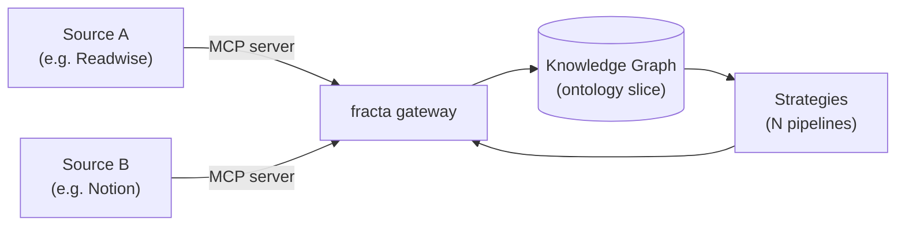
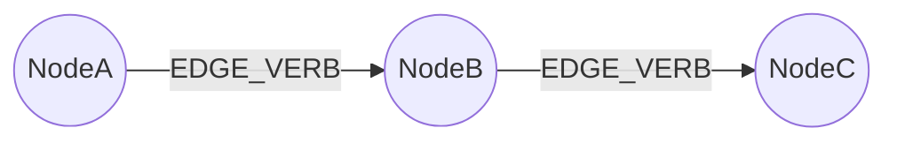

{/*
  ─────────────────────────────────────────────────────────────────────────────
  Fracta Patterns — Page Template
  ─────────────────────────────────────────────────────────────────────────────
  This file is the canonical skeleton for a pattern's six pages. Copy the
  sections you need into the matching file under patterns/<your-pattern>/:

    overview.mdx       use sections marked [OVERVIEW]
    setup.mdx          use sections marked [SETUP]
    ontology.mdx       use sections marked [ONTOLOGY]
    strategies.mdx     use sections marked [STRATEGIES]
    first-run.mdx      use sections marked [FIRST-RUN]
    extending.mdx      use sections marked [EXTENDING]

  Every page must have its own frontmatter with title + description.
  Every page must use ## (not #) for top-level sections — Mintlify renders
  the frontmatter title as the H1 automatically.

  Voice rules (from /docs/AGENTS.md):
    - Second person ("you spawn an agent"), present tense, imperative for steps.
    - No bare `<` outside code fences. Never `<1 minute`; write "under a minute".
    - Internal links are absolute paths, no .md extension: /patterns/foo/bar
    - Replace mid-doc `---` rules with <hr /> — frontmatter `---` is the only
      one Mintlify accepts in a page.

  Required `influences` frontmatter field:
    Every Pattern declares its lineage. Short list, 1–3 entries. This sets
    reader expectations and credits the prior art the pattern stands on.

  PKM vocabulary to AVOID (loaded / trademarked / mis-fit):
    - "Second Brain" (Forte trademark)
    - "Permanent Note", "Evergreen Notes" as a strategy or node label
    - "Maps of Content" / "MOC"
    - PARA-flavored terms (Projects / Areas / Resources / Archives)
    Use the CODE flow (Capture / Organize / Distill / Express) as the
    spine when the pattern handles a knowledge-management domain — it
    maps cleanly onto fracta primitives (MCP ingest / DuckDB strategies /
    graph mutation / publishing).

  Delete this comment block from the real pages.
  ─────────────────────────────────────────────────────────────────────────────
*/}

{/* ============================================================ */}
{/* [OVERVIEW] sections                                          */}
{/* ============================================================ */}

## What you'll build

One paragraph — concrete, finished-state. Tell the reader what the stack *does* once it's running. Not "you'll learn about X" — "you'll have a system that ingests Y from Z, surfaces W, and lets you ask questions about V from any agent."

## Influences

A short prose paragraph (or compact bulleted list) that names the prior art this pattern stands on — the same entries listed in the frontmatter `influences` field, expanded into one line each. Knowledge-management patterns should explicitly cite the lineage they inherit from (BASB, digital gardens, zettelkasten, etc.) so the reader can place this pattern on the map.

## How this pattern maps onto fracta

If the pattern follows a recognized methodology (e.g. **CODE** — Capture / Organize / Distill / Express — for knowledge-management patterns), use a four-row table to show how each stage of the methodology is fulfilled by a fracta primitive. Skip this section if no widely-recognised methodology applies.

| Stage | What it means | Fracta primitive |
|---|---|---|
| **Capture** | (e.g.) Pull raw input from the source | MCP servers ingesting via the gateway |
| **Organize** | (e.g.) Land the input in structured tables | DuckDB-staged tables in strategies |
| **Distill** | (e.g.) Compress raw input into atomic units | Strategies + agent calls writing to the graph |
| **Express** | (e.g.) Surface the result back into a venue | A publishing strategy or downstream MCP write |

## When to use this pattern

A short bulleted list of the situations the pattern solves well, and the ones it doesn't. Examples:

- **Use it when:** you have N data sources, you want to capture entity X, you regularly need to answer question Y.
- **Skip it when:** you don't yet have any of the source data; you need real-time streaming (this pattern is batch); you need entity types this ontology doesn't model.

Honesty here saves the reader an hour of going down the wrong road.

## The stack at a glance

A single mermaid diagram that names every moving piece — MCP servers on the left, fracta gateway in the middle, knowledge graph + strategies on the right. The reader should be able to skim this and know exactly what they're committing to.



## Pattern at a glance

A 4-row table for fast scanning:

| | |
|---|---|
| **MCP servers** | `<server-1>`, `<server-2>` |
| **Ontology nodes** | `<NodeA>`, `<NodeB>`, `<NodeC>` |
| **Strategies** | `<strategy-1>`, `<strategy-2>` |
| **Estimated setup time** | Under 30 minutes |

## What's next

```jsx
<Cards>
  <Card title="Setup" href="/patterns/<slug>/setup">
    Install the MCP servers, provision credentials, write the fracta.yaml block.
  </Card>
  <Card title="Ontology" href="/patterns/<slug>/ontology">
    The nodes and edges this pattern writes — and why.
  </Card>
</Cards>
```

{/* ============================================================ */}
{/* [SETUP] sections                                             */}
{/* ============================================================ */}

## Prerequisites

A short Steps block, gated. Each item must be a yes/no the reader can verify before reading on.

```jsx
<Steps>
  <Step title="Fracta installed and a runtime configured">
    See [Installation](/getting-started/installation) and
    [Your First Agent](/getting-started/first-agent) if not.
  </Step>
  <Step title="Account / API key for each external service">
    List them: e.g. a Notion integration token; a Readwise access token.
  </Step>
  <Step title="A clean knowledge graph (or an empty namespace)">
    This pattern writes specific node types — clashes with an existing graph
    can produce surprising results.
  </Step>
</Steps>
```

## Install the MCP servers

For each server, name it, point at the upstream repo, give the install command, and show the **smallest possible** registration block in `fracta.yaml`.

```yaml
mcp_servers:
  - name: notion
    transport: stdio
    command: ["npx", "-y", "@notionhq/notion-mcp-server"]
    env:
      NOTION_API_KEY: "${NOTION_API_KEY}"
```

Use `<CodeGroup>` to stack a per-server block when you have more than one.

## Provision credentials

Cross-link to the credential pipeline. Don't re-explain auth — point at it:

> Auth is centralised. Define each token in your `fracta.yaml` `auth` block and reference it from the MCP server registration. See [Credential Pipeline](/guides/authentication/credential-pipeline) for the schema.

Then list the **specific scopes / permissions** each token needs for this pattern. Not "a Notion token" — "a Notion integration token with `read_content`, `update_content`, and access shared to the parent page."

## Verify the stack

Three commands the reader runs to prove the wiring worked. The point of this section is the reader should hit a green check before continuing to the ontology page.

```bash
fracta registry list
# expect: <server-1>, <server-2> ... status=ok

fracta spawn --task verify --contract "Call <server-1>.list_X and report the count"
fracta peek verify
# expect: a number, not an auth error
```

## What's next

Card to **Ontology** as the natural next read.

{/* ============================================================ */}
{/* [ONTOLOGY] sections                                          */}
{/* ============================================================ */}

## The shape

Open with a mermaid entity diagram. Every node, every edge, label the relationship verbs. The diagram is the page's anchor — every later section reads against it.



## Nodes

One H3 per node type. Each one gets:
- A one-sentence purpose ("an atomic note distilled from one or more highlights")
- A property table (name, type, required, description)
- The MCP source the property is populated from, when relevant

```markdown
### NodeA

A short purpose sentence.

| Property | Type | Required | Source | Description |
|---|---|---|---|---|
| `id` | string | yes | — | Stable identifier |
| `title` | string | yes | <server>.<tool> | ... |
```

## Edges

A single table is usually enough. List every relationship, what it means, and the cardinality.

| Edge | From | To | Cardinality | Meaning |
|---|---|---|---|---|
| `MENTIONS` | NodeA | NodeB | many-to-many | A references B |
| `WRITTEN_BY` | NodeA | NodeC | many-to-one | Author |

## Provenance

How `_source` is set on every node this pattern writes. (Reading garden uses `_source = 'pattern:reading-garden'` — same convention should be encouraged for new patterns.)

## What's next

Card to **Strategies** — once the ontology is clear, the strategies are the verbs.

{/* ============================================================ */}
{/* [STRATEGIES] sections                                        */}
{/* ============================================================ */}

## What ships

A table of the strategies bundled with this pattern. Each row links to the strategy file in the repo (full GitHub URL).

| Strategy | Category | Purpose | Source |
|---|---|---|---|
| `<slug>` | enrichment | One-line purpose | [link](https://github.com/darkquasar/fracta/tree/main/strategies/...) |

## Per-strategy reference

One H3 per strategy. Use the contract.yaml as the source of truth. Each section lists:

- **Purpose** — one paragraph
- **Inputs** — params table (name, type, required, default)
- **Outputs** — what the agent gets back, with a sample JSON
- **Calls it like** — a copy-pasteable `strategy_run(...)` example

````jsx
<CodeGroup>
```bash CLI via agent
fracta spawn --task ask \
  --contract "Run strategy <slug> for the past 30 days"
```

```python In Python
ctx.runner.call("strategy-slug", params={"window": "30d"})
```
</CodeGroup>
````

## What's next

Card to **First Run** — the proof that everything wired up works.

{/* ============================================================ */}
{/* [FIRST-RUN] sections                                         */}
{/* ============================================================ */}

## What you'll do

Two sentences, max. "Ingest N items, watch the graph fill, run one strategy, read the result." The reader needs to know the rough scope before they commit ten minutes.

## Step 1 — Ingest a sample

A `<Steps>` block. The first step pulls the **smallest meaningful subset** — one Notion page, ten highlights, one CloudTrail hour. The point is to not wait. Show the exact `fracta spawn` command and the contract text.

## Step 2 — Inspect the graph

A copy-pasteable Cypher (or your graph backend's query) that returns the node count by type. The reader should see a non-zero, plausible number.

```bash
fracta graph query "MATCH (n) RETURN labels(n)[0] as type, count(*) ORDER BY count(*) DESC"
```

## Step 3 — Run a strategy

The single most useful strategy in the pattern. Show the call, show the (truncated) sample output. This is the payoff — the entire pattern was built to produce this answer.

## Step 4 — Read the result

Two-paragraph interpretation: what does the strategy's answer mean, what would change if you ran it tomorrow, what should you do next.

## What's next

Card to **Extending** — the natural "now make it yours" follow-up.

{/* ============================================================ */}
{/* [EXTENDING] sections                                         */}
{/* ============================================================ */}

## The seams

The places this pattern is designed to be cut and grown. Be explicit. There are usually four:

1. **Add a new source** — register another MCP server, write a small adapter strategy, link its output into existing nodes.
2. **Add a node type** — extend the ontology slice without touching existing nodes.
3. **Add a strategy** — write a new `contract.yaml` + `strategy.py` that reads from the existing tables/graph.
4. **Replace a backend** — swap one MCP server for another with the same shape (e.g. swap Notion for Obsidian).

For each seam, say what files change and which don't. Readers reach this page when they've already invested in the pattern; they want to know the minimum diff to get their addition working.

## A worked extension

Pick one of the four seams above and walk through it end-to-end. Smaller is better — a 30-line strategy added to the existing tables is more useful than a sweeping ontology rewrite.

## What this pattern *won't* support

The honest section. List the requests that would force a rewrite. ("Real-time streaming," "multi-tenant graph isolation," "more than ~5k highlights per ingest.") Naming limits early stops the reader from over-investing.

## Sibling patterns and future directions

Where appropriate, name-drop sibling patterns or future strategies that would extend the pattern beyond its current ceiling — without shipping them. This signals awareness and gives readers a vocabulary for the request they may already be forming. For knowledge-garden patterns, this typically includes a public-publishing sibling (e.g. a future `mintlify_publish` or `quartz_publish` strategy) — Notion-as-target is a *narrower* interpretation of the digital-garden tradition, and acknowledging the broader path keeps the pattern honest.

## What's next

Two cards: back to the pattern's **Overview** for re-reading, and over to [Patterns overview](/patterns/overview) for the catalogue of other patterns.
