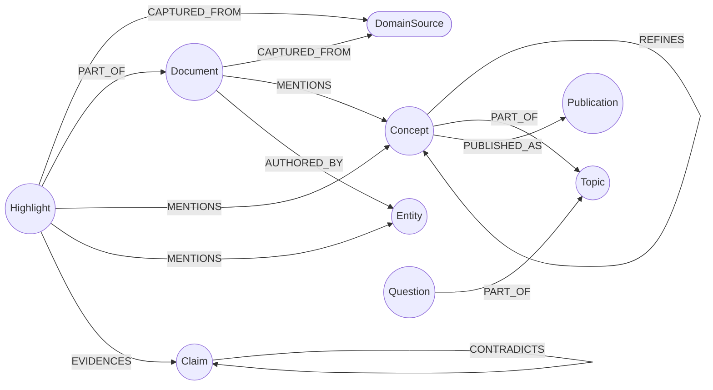

The Reading Garden ontology is a small, opinionated slice of the knowledge graph — eight node types and nine edges — designed for one job: turn raw highlights into atomic, queryable, idempotently-publishable Concept pages **plus the navigable evidence around them** (the Sources and Highlights they came from), without forcing every reader to commit to a single PKM methodology.

Since v0.5.2 the published artefact is a **three-database mirror in Notion** (Sources / Highlights / Concepts, linked via RELATION columns), not a flat dump of Concept pages — see the "Publishing layer" section below.

The slice lives at `internal/schema/embedfs/graph-schema/knowledge-garden/` in the fracta repo (see [`internal/schema/embedfs/graph-schema/knowledge-garden`](https://github.com/darkquasar/fracta/tree/main/internal/schema/embedfs/graph-schema/knowledge-garden) for the loader-validated source of truth) and is resolved at runtime as `embed://graph-schema/knowledge-garden`. It plugs into the broader fracta schema via the `core/DomainSource` cross-family edge, so Reading Garden nodes show up in the same 4-tier resolution chain (`DomainSource -> DataStore -> MCPServer -> MCPTool`) as every other family.

## The shape

Every later section reads against this diagram. The two anchor node types are **Highlight** (the raw unit of capture) and **Concept** (the atomic, publishable unit of distilled thought). Everything else exists to connect those two through the CODE flow (Capture -> Organize -> Distill -> Express).

## Layers

The schema family follows fracta's two-layer convention:

- **Universal layer** (`nodes/`): one node — `Topic`. Universal nodes are user-curated and re-used across particulars.
- **Particular layer** (`particulars/`): seven nodes — `Highlight`, `Document`, `Concept`, `Entity`, `Claim`, `Question`, `Publication`. Particulars are discovered by strategies and tied to a writer-of-record.

The loader enforces `layer` membership; you cannot register a `particular` node under `nodes/`.

## Nodes

### Topic

A user-curated theme that groups Concepts and Questions. The only **scaffold-authority** node in this family — populated by the user (or a future curation strategy), never by the ingest pipeline.

| Property | Type | Required | Source | Description |
|---|---|---|---|---|
| `name` | string | yes | user | Unique identifier — the topic name. |
| `description` | string | no | user | One-line description of the theme. |

### Highlight

A single highlight pulled from a source — typically a Kindle/article highlight in Readwise. The atomic unit of capture.

| Property | Type | Required | Source | Description |
|---|---|---|---|---|
| `id` | string | yes | `readwise_list_highlights` | Stable identifier, prefixed `readwise:<id>`. |
| `text` | string | yes | `readwise_list_highlights` | The highlight body. |
| `note` | string | no | `readwise_list_highlights` | The Readwise highlight-note field (your own annotation, if any). Extractors scan this too. |
| `book_id` | string | no | `readwise_list_highlights` | Foreign key to the source `Document`. |
| `location` | string | no | `readwise_list_highlights` | Position in the source (page, percent, timestamp). |
| `tags` | string | no | `readwise_list_highlights` | Comma-joined Readwise tags. |
| `highlighted_at` | string | no | `readwise_list_highlights` | ISO-8601 timestamp of the original highlight. |
| `captured_at` | string | yes | `highlight_distill` | ISO-8601 timestamp of when fracta ingested it. |

Populated by `highlight-distill`. Every Highlight must be wired to a `DomainSource` via `CAPTURED_FROM` (enforced by checkpoint `highlight_missing_captured_from`).

<Note>
  **Denormalised book fields.** Since v0.5.2 the Readwise binding pulls a set of `book_*` fields (`book_title`, `book_author`, `book_category`, `book_source`, `book_source_url`, `book_cover_image_url`, `book_document_note`) alongside each highlight via the explicit `response_fields` argument. These are NOT stored on the Highlight node — they're used only to MERGE the parent `Document` node (one per `book_id`). Resolve denormalised metadata by walking `Highlight -[:PART_OF]-> Document`. Closes Bug 13: the v1 reader-documents namespace mismatch meant `PART_OF` never fired; v3 derives Documents from highlights themselves.
</Note>

### Document

The container a Highlight comes from — a book, article, podcast, paper, or web page.

| Property | Type | Required | Source | Description |
|---|---|---|---|---|
| `id` | string | yes | `highlight-distill` | Stable identifier; v3 form is `readwise:book:<book_id>` (derived from highlights, see Note below). |
| `title` | string | yes | `highlight-distill` | Title of the work. Sourced from `Highlight.book_title` (denormalised). |
| `author` | string | no | `highlight-distill` | Author name. Sourced from `Highlight.book_author` (denormalised). |
| `url` | string | no | `highlight-distill` | Canonical URL — `Highlight.book_source_url`. |
| `cover_url` | string | no | `highlight-distill` | Cover image URL — `Highlight.book_cover_image_url`. |
| `category` | string | no | `highlight-distill` | Document category — `Highlight.book_category` (e.g. `book`, `article`). |
| `source_kind` | string | no | `highlight-distill` | Upstream source kind — `Highlight.book_source` (e.g. `kindle`, `airr`). |
| `document_note` | string | no | `highlight-distill` | The Readwise document-note field (book-level annotation) — `Highlight.book_document_note`. |
| `captured_at` | string | yes | `highlight-distill` | ISO-8601 ingest timestamp. |

<Note>
  **v3 Document derivation (Bug 13 fix).** v1/v2 attempted to MERGE Documents from the separate `reader_list_documents` MCP call, which lives in a different ID namespace from Readwise highlights — so `Highlight -[:PART_OF]-> Document` edges never fired. v3 derives Documents directly from the highlights themselves (`MERGE (d:Document {id: 'readwise:book:' + book_id})`) using the denormalised `book_*` properties listed above. The Readwise binding's `response_fields` argument is what makes those fields non-null on every highlight.
</Note>

### Concept

The atomic, publishable unit — a distilled idea that recurs across highlights. The other anchor of this ontology.

| Property | Type | Required | Source | Description |
|---|---|---|---|---|
| `name` | string | yes | `highlight_distill` | Unique canonical name (lower-case, normalised). |
| `display_name` | string | no | `highlight_distill` | Cased version used in renders. |
| `description` | string | no | future / agent | Optional one-line gloss. |
| `confidence` | float | no | `cross_source_concepts` | Graph-aware confidence in `[0, 1]`. **Exclusive writer:** `cross_source_concepts`. |
| `extraction_score` | float | no | `highlight_distill` | Rolling max of `MENTIONS.extraction_score`. **Exclusive writer:** `highlight_distill`. |
| `epistemic_status` | string | no | `notion_publish` | One of `seedling`, `budding`, `evergreen`. Derived from `confidence` at publish time. |
| `mention_count` | int | no | `cross_source_concepts` | Count of inbound `MENTIONS`. |
| `_status` | string | no | strategies | `speculative` / `confirmed` / `stale` lifecycle marker. |
| `first_seen_at` | string | no | `highlight_distill` | ISO-8601 of first ingest. |
| `last_seen_at` | string | no | `highlight_distill` | ISO-8601 of most recent ingest. |

<Note>
  **`extraction_score` vs `confidence` is intentional.** They are separate properties with **distinct writers-of-record**. `extraction_score` reflects what the NLP extractors saw at ingest time (per-extractor agreement and signal, see [Strategies — highlight-distill](/patterns/reading-garden/strategies#highlight-distill)). `confidence` reflects graph-wide signal computed later (recency × frequency × source diversity, folded with mean extraction_score). The checkpoint rule `concept_low_extraction_high_confidence` flags drift between them as alias-suspicion — the canonical surfacing of "this Concept is probably an alias to another one." Mirror this seam if you author a strategy that touches Concept scoring.
</Note>

### Entity

A typed real-world referent — a person, place, organisation, work, or product — mentioned in Highlights or Documents. Typed entities ground Concepts; "Karl Popper" the Person is distinct from "falsifiability" the Concept.

| Property | Type | Required | Source | Description |
|---|---|---|---|---|
| `id` | string | yes | `highlight_distill` | Stable identifier. |
| `name` | string | yes | `highlight_distill` | Display name. |
| `kind` | string | yes | `highlight_distill` | One of `person`, `place`, `org`, `work`, `product`. |
| `canonical_url` | string | no | future | Optional canonical reference (Wikipedia, etc.). |
| `extraction_score` | float | no | `highlight_distill` | Per-entity extraction confidence. Mirrors `Concept.extraction_score`. |

Authoritative typer is `concept-gliner` (the only extractor with calibrated per-span probability and caller-supplied taxonomy). `concept-spacy` NER acts as a fallback typer; `concept-keybert` is untyped and never produces Entity routes.

### Claim

A statement asserted or questioned in the source material. Forward-looking — `highlight_distill` does not produce Claims in v1; the node type exists for future strategies that perform claim extraction.

| Property | Type | Required | Source | Description |
|---|---|---|---|---|
| `id` | string | yes | future strategies | Stable identifier. |
| `text` | string | yes | future strategies | The claim verbatim. |
| `stance` | string | no | future strategies | One of `asserted`, `questioned`. |
| `confidence` | float | no | future strategies | Strength of the claim's support in the graph. |

### Question

An open inquiry the reader (or a future strategy) wants to track. Like `Topic`, primarily user-curated in v1.

| Property | Type | Required | Source | Description |
|---|---|---|---|---|
| `id` | string | yes | user / future | Stable identifier. |
| `text` | string | yes | user / future | The question text. |
| `status` | string | no | user / future | One of `open`, `exploring`, `answered`, `abandoned`. |

### Publication

A record of a Concept (or Topic / Document) published to an external sink. The idempotency anchor — `notion_publish` reads `Publication.content_hash` before deciding whether to write.

| Property | Type | Required | Source | Description |
|---|---|---|---|---|
| `id` | string | yes | `notion_publish` | Stable identifier. |
| `sink` | string | yes | `notion_publish` | v3 distinguishes per-database sinks: `notion:source`, `notion:highlight`, `notion:concept`. Future sinks: `mintlify`, `quartz`, `obsidian`, `ghost`. |
| `external_id` | string | yes | `notion_publish` | Sink-side identifier (e.g. the Notion page UUID). |
| `content_hash` | string | yes | `notion_publish` | Hash of the rendered content; basis for skip-vs-update decisions. |
| `url` | string | no | `notion_publish` | Direct URL to the published page. |
| `published_at` | string | yes | `notion_publish` | ISO-8601 of first publish. |
| `last_updated_at` | string | yes | `notion_publish` | ISO-8601 of most recent update. |

<Note>
  **`Publication.sink` is the future-proofing seam.** A future `mintlify_publish` strategy populates the same node type with `sink: "mintlify"`. The graph stays canonical; sinks multiply. Indexed on both `id` and `external_id` for fast idempotent lookup.
</Note>

## Edges

| Edge | From | To | Cardinality | Properties | Meaning |
|---|---|---|---|---|---|
| `MENTIONS` | `Highlight`, `Document` | `Concept`, `Entity` | many-to-many | `weight`, `extracted_by`, `extraction_score`, `agreement_n` | The most-traversed edge. `extracted_by` is pipe-joined (e.g. `keybert\|gliner`); `agreement_n` is `1`, `2`, or `3`. |
| `EVIDENCES` | `Highlight`, `Document` | `Claim` | many-to-many | `strength` | Source-of-evidence link. |
| `CONTRADICTS` | `Highlight`, `Document`, `Claim` | `Claim` | many-to-many | — | Refutation chain; reflexive `Claim -> Claim` allowed. |
| `REFINES` | `Concept`, `Claim` | `Concept`, `Claim` | many-to-many | — | Hierarchy without forcing a tree. |
| `PART_OF` | `Highlight`, `Concept`, `Question`, `Claim` | `Document`, `Topic` | many-to-one | — | Composition. Single edge type by design. |
| `AUTHORED_BY` | `Document` | `Entity` | many-to-many | `role` (author/editor/translator/host) | Authorship and contribution. |
| `CAPTURED_FROM` | `Highlight`, `Document` | `DomainSource` | many-to-one | `captured_at` | **Cross-family edge** to `core/DomainSource`. The hook into fracta's 4-tier resolution chain. |
| `RELATES_TO` | `Concept`, `Entity`, `Topic`, `Question`, `Claim`, `Document`, `Highlight` | (same set) | many-to-many | `weight`, `reason`, `computed_by` | Generic associative — the free Zettelkasten link. |
| `PUBLISHED_AS` | `Concept`, `Topic`, `Document` | `Publication` | many-to-many | `first_published_at`, `last_published_at` | Idempotency partner. |

## Provenance

Every node written by this pattern carries `_source = 'strategy:<name>'`, matching fracta's convention. Cross-family writes follow the same rule: when `highlight_distill` MERGEs the `Readwise Highlights` `DomainSource`, it sets `_source = 'strategy:highlight_distill'` on creation only — subsequent runs do not overwrite the originating attribution.

Encourage the same convention for any new pattern: one writer-of-record per node, declared in the strategy name, traceable via `_source`. The checkpoint rules in `internal/schema/embedfs/graph-schema/knowledge-garden/checkpoint.yaml` lean on this — for example, `concept_low_extraction_high_confidence` only makes sense when `extraction_score` and `confidence` have separate authors.

## Checkpoint rules

Eight validation rules ship with the family. The two most consequential:

- `highlight_missing_captured_from` (error): every Highlight must be wired to a `core/DomainSource`. Without this, the 4-tier resolution chain breaks.
- `concept_low_extraction_high_confidence` (warning): flags Concepts where `confidence > 0.7` but `extraction_score < 0.4` (or null) — the alias-drift detector. A graph-corroborated Concept that no NLP extractor strongly endorsed is almost always an alias to another Concept, surfaced for hand-merging until a future strategy (embedder MCP or LLM-based resolution) can do it automatically.

The remaining six (`orphaned_concept_no_mentions`, `publication_missing_parent_concept`, `high_confidence_concept_without_topic`, `publication_missing_required_props`, `claim_without_evidence`, `concept_confidence_status_mismatch`) live in [`internal/schema/embedfs/graph-schema/knowledge-garden/checkpoint.yaml`](https://github.com/darkquasar/fracta/blob/main/internal/schema/embedfs/graph-schema/knowledge-garden/checkpoint.yaml). Run `graph_checkpoint(mcp_servers='notion,readwise,concept-keybert,concept-gliner,concept-spacy')` after any ingest to surface them.

## Publishing layer (Notion three-database mirror)

Since v0.5.2 the published artefact is a navigable Notion structure, not a flat dump of Concept pages. The publishing layer maps the graph's three-tier `DomainSource -> Document -> Highlight` onto three Notion databases connected by RELATION columns:

| Graph tier | Notion database | Sink | Page-per | RELATION |
|---|---|---|---|---|
| `Document` (from `Highlight.book_id`) | Sources DB | `notion:source` | Readwise book / article | — |
| `Highlight` | Highlights DB | `notion:highlight` | Readwise highlight | `source` -> Sources DB |
| `Concept` | Concepts DB | `notion:concept` | Atomic concept | `highlights` -> Highlights DB |

Each tier is idempotent independently: a `Publication` node is MERGEd per page with `sink: 'notion:<tier>'` and a tier-specific `external_id` (`readwise_book_id`, `readwise_highlight_id`, `concept_name`). Re-running `notion-publish` after no graph changes is a no-op (content-hash skip) at all three levels.

The three RELATION values are written as **JSON-stringified arrays of page IDs**, not native arrays — that is the on-the-wire convention the hosted Notion MCP expects for properties of type RELATION.

See [Strategies — notion-publish](/patterns/reading-garden/strategies#notion-publish) for the call shape and the 7-step DAG (`load_target_concepts -> load_supporting_highlights -> load_sources -> publish_sources -> publish_highlights -> render_concepts -> publish_concepts`).

## What's next

<Cards>
  <Card title="Strategies" href="/patterns/reading-garden/strategies">
    The three strategies that populate this ontology — params, outputs, source links.
  </Card>
  <Card title="First Run" href="/patterns/reading-garden/first-run">
    See it work end-to-end against your own Readwise account.
  </Card>
</Cards>
