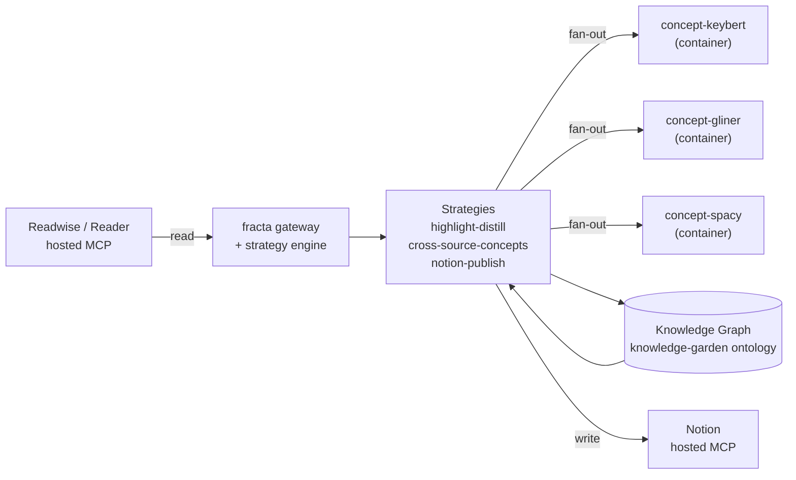

The Reading Garden is the first pattern fracta ships. It takes the highlights you have already captured in Readwise (or Reader), runs them through a small NLP pipeline that extracts and ranks atomic Concepts, and publishes the highest-confidence Concepts back to a Notion database as connected, evolving pages — each tagged with an epistemic-status header (`seedling` / `budding` / `evergreen`) that reflects how the graph currently weights it.

You drive the whole pipeline from one Claude worker, with one prompt. The strategies are deterministic Python pipelines; the LLM only holds the orchestration framing.

## What you'll build

A stack that ingests Readwise highlights, distills them into a queryable Concept graph, and republishes the highest-confidence Concepts to Notion idempotently. Re-running with no new data is a no-op (content-hash skip); re-running after new highlights land updates existing pages in place rather than creating duplicates. Once it is wired, leaving it scheduled gives you a Notion workspace that quietly grows with your reading.

## Influences

The Reading Garden does not invent a methodology — it wires fracta into the ones the field has already settled on:

- **BASB CODE flow** ([Tiago Forte](https://fortelabs.com/blog/basboverview/)) — Capture / Organize / Distill / Express. The pattern's narrative spine. `highlight-distill` is Capture+Organize; `cross-source-concepts` is Distill; `notion-publish` is Express.
- **Digital gardens** ([Maggie Appleton's history](https://maggieappleton.com/garden-history)) — letting ideas grow in public over time, with explicit epistemic status (seedling / budding / evergreen). The Reading Garden uses a private Notion workspace as the "garden" by default, which is a deliberately narrower interpretation than the canonical public-web garden; a future `mintlify_publish` / `quartz_publish` sibling strategy makes the public path a one-line extension.
- **Atomic / evergreen notes** (Andy Matuschak, zettelkasten lineage) — one idea per Concept node, linked rather than nested. The schema slice ([Ontology](/patterns/reading-garden/ontology)) is built around atomicity; `Concept.epistemic_status` is the surfaced version of Matuschak's evergreen vocabulary.

## How this pattern maps onto fracta

| CODE stage | What it means | Fracta primitive | Reading Garden artifact |
|---|---|---|---|
| **Capture** | Pull raw input from the source | MCP servers ingesting via the gateway | Readwise MCP via `mcp-remote` — pulls `Highlight`s and `Document`s |
| **Organize** | Land the input in structured tables | DuckDB-staged tables in strategies | `highlight-distill` stages Readwise paginated results into per-run DuckDB tables (`recent_highlights`, `recent_documents`) |
| **Distill** | Compress raw input into atomic, linkable units | Strategies + agent calls writing to the graph | NLP-extractor fan-out (`concept-keybert` + `concept-gliner` + `concept-spacy`) merges into Concept / Entity nodes; `cross-source-concepts` rescores them graph-wide |
| **Express** | Surface the result back into a venue | A publishing strategy or downstream MCP write | `notion-publish` renders the top-N Concepts as Notion pages, idempotent via `Publication.content_hash` |

## When to use this pattern

**Use it when:**

- You have at least a few hundred highlights in Readwise (or Reader) and want them connected rather than just searchable.
- You want a Notion workspace that grows with your reading without manual maintenance.
- You are willing to run three small extractor containers locally (~5.3 GB on disk, ~1.5–2 GB RAM resident — see [Setup](/patterns/reading-garden/setup#prerequisites)).
- You want the option to extend into Raindrop / Zotero / PDFs later without forking the pipeline.

**Skip it when:**

- You have not yet captured highlights anywhere — get reading data flowing first, then come back.
- You want public-web garden publishing (Mintlify / Quartz). Named in [Extending](/patterns/reading-garden/extending#sibling-patterns-and-future-directions) as future work; not in v1.
- You want real-time streaming. This pattern is batch by design.
- You want PARA-shaped active-work tracking. Project Companion is the (future) sibling pattern for that.

Honesty here saves an hour of going down the wrong road.

## The stack at a glance

## Pattern at a glance

| | |
|---|---|
| **MCP servers** | `readwise`, `notion`, `concept-keybert`, `concept-gliner`, `concept-spacy` |
| **Ontology nodes** | `Topic`, `Highlight`, `Document`, `Concept`, `Entity`, `Claim`, `Question`, `Publication` |
| **Strategies** | `highlight-distill`, `cross-source-concepts`, `notion-publish` |
| **Estimated setup time** | About 15 minutes (most of it OAuth pop-ups and one Notion sharing click) |
| **End-to-end first run** | Under 30 minutes from `git clone` to first published Notion page |

## What's next

<Cards>
  <Card title="Setup" href="/patterns/reading-garden/setup">
    Install the MCP servers, complete OAuth, and verify the stack.
  </Card>
  <Card title="Ontology" href="/patterns/reading-garden/ontology">
    The eight node types and nine edges this pattern writes — with property tables.
  </Card>
  <Card title="Strategies" href="/patterns/reading-garden/strategies">
    `highlight-distill`, `cross-source-concepts`, `notion-publish` — every param, every output shape.
  </Card>
  <Card title="First Run" href="/patterns/reading-garden/first-run">
    Spawn one Claude worker with one prompt; publish your first Concept page to Notion.
  </Card>
</Cards>
