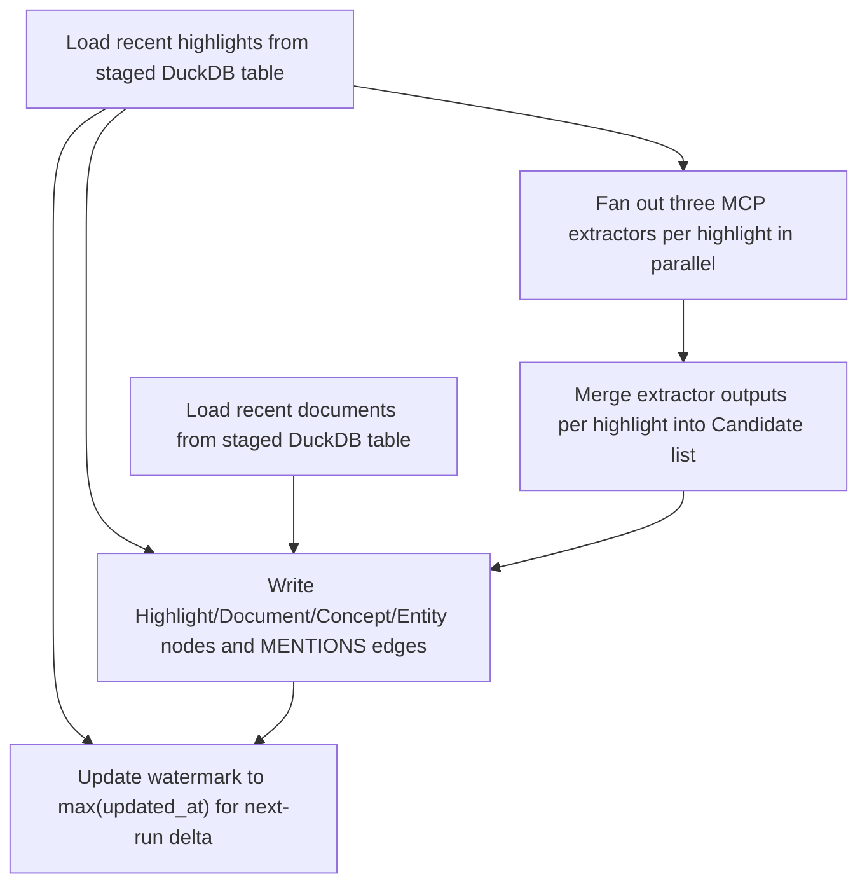

{/* AUTOGENERATED by scripts/gen-strategy-catalogue.py — do not edit. */}
{/* Source: strategies/knowledge-garden/enrichment/highlight_distill/ */}

# highlight-distill

Distill Readwise highlights into Highlight, Document, Concept, and Entity nodes. Fan-out three concept-extraction MCPs (keybert, gliner, spacy) per highlight in parallel, merge their outputs with the asymmetric-base scoring algorithm (spec-41 §4.1.1), and route candidates to graph commit, DuckDB staging, or discard based on the per-mention extraction_score.

| | |
|---|---|
| **Domain** | `knowledge-garden` |
| **Category** | `enrichment` |
| **Version** | `1.0.0` |
| **Tags** | `enrichment`, `knowledge-garden`, `readwise` |
| **Source** | [`strategies/knowledge-garden/enrichment/highlight_distill/`](https://github.com/darkquasar/fracta/tree/main/strategies/knowledge-garden/enrichment/highlight_distill) |

## About

## What this strategy does

Reads recent Readwise highlights + documents, fans out three concept-extraction
MCPs per highlight (`concept-keybert`, `concept-gliner`, `concept-spacy`) in
parallel, merges their outputs with an asymmetric-base scoring algorithm, and
writes `Highlight`, `Document`, `Concept`, and `Entity` nodes (plus
`MENTIONS`, `CAPTURED_FROM`, `PART_OF` edges) into the knowledge graph.

This is the first stage of the Reading Garden pipeline. The downstream
strategies build on its output: `cross_source_concepts` folds the
per-mention `extraction_score` into a graph-aware `Concept.confidence`,
and `notion_publish` renders the highest-confidence concepts to Notion.

## When to use it

- After connecting a Readwise account via mcp-remote.
- On a cron / scheduled run to pick up new highlights since the last
  `_watermark` row (the strategy delta-pulls automatically).

## How it works

Six steps (DAG):

1. **load_highlights** — DuckDB read of the `recent_highlights` table that
   the binding pre-stages via Readwise's `list_highlights` MCP tool.
2. **load_documents** — same for `recent_documents`.
3. **extract_concepts** — for each highlight, three MCP calls in parallel
   (`ThreadPoolExecutor(max_workers=8)`, 30 s timeout per call). Returns
   the raw responses keyed by highlight id.
4. **merge_concepts** — calls the pure `merge_extractor_outputs` function
   (`merge.py`) on each highlight's three responses. The function clusters
   surface forms by offset overlap → canonical key → substring fallback,
   derives a per-cluster `extraction_score` (gliner-sigmoid where present,
   keybert rank-tier otherwise, spacy priors as last resort), applies
   agreement / type-consistency bonuses and weak-join penalties, MMR-
   diversifies the top-K, and routes each cluster to `entity` / `concept`
   / `stage` / `discard` based on a 0.40 commit threshold and a 0.30
   staging threshold.
5. **write_graph** — branches on `Candidate.route`:
   - `entity` / `concept`: MERGE the node, write `extraction_score` as
     rolling max, MERGE the `MENTIONS` edge with `weight`,
     `extracted_by` (pipe-joined extractor ids), `extraction_score`,
     `agreement_n`. Also MERGE the `DomainSource("Readwise Highlights")`
     + `DataStore("fracta-mcp-gateway://readwise/")` + `QUERYABLE_VIA →
     MCPServer{config_key:'readwise'}` chain per spec §3.6.
   - `stage`: append to a DuckDB `pending_extractions` table; a future
     strategy graduates them when they cross `MIN_HIGHLIGHTS_FOR_COMMIT = 2`.
   - `discard`: no-op.
6. **update_watermark** — write `max(updated_at)` to a DuckDB `_watermark`
   table for next-run delta.

## Ownership seam (read me before editing)

This strategy writes **`Concept.extraction_score`** (rolling max),
**`Entity.extraction_score`**, **`MENTIONS.weight`**,
**`MENTIONS.extracted_by`**, **`MENTIONS.extraction_score`**, and
**`MENTIONS.agreement_n`**.

It does **NOT** write `Concept.confidence`, `Concept.mention_count`, or
`Concept.epistemic_status`. Those fields belong to `cross_source_concepts`
and `notion_publish` respectively. The two-writer authority pattern mirrors
spec-32; a checkpoint rule (`concept_low_extraction_high_confidence`) flags
drift between extraction-time and graph-time confidence as alias-suspicion.

## What you need to adapt in your binding

- `config_key` / `mcp_server` for `readwise` — your registered MCP server
  name. The defaults assume `readwise` (the mcp-remote convention).
- `extraction_config.*` — knobs from spec §9. The defaults are tuned for
  the v1 gliner taxonomy and the Readwise highlight length distribution;
  raise `commit_threshold` for stricter graphs, lower it to surface more
  borderline candidates.
- `extraction_config.gliner_labels` — the per-call label taxonomy gliner
  scores against. Domain-specific labels can be substituted for source
  classes that need different concept-shape detection.

## Caveats

- **No chunking in v1.** Highlights longer than 240 tokens proceed without
  splitting; only the first-window extraction is captured (keybert
  truncates at MiniLM's 256-token context, gliner at DeBERTa-v3's). A
  follow-up spec introduces `chunk_long_text` with per-window merging.
- **No alias merging.** `popper` and `karl popper` can commit as separate
  Entity candidates because keybert does not expose per-keyphrase
  embeddings. The `concept_low_extraction_high_confidence` checkpoint
  rule flags surviving aliases once they accumulate graph corroboration.
- **Session-pinning matters.** `concept-gliner` loads ~1.4 GB DeBERTa
  weights per MCP session. The gateway must pin `mcp-session-id` to a
  specific upstream pod, or every call reloads the model (10–30 s per
  request). Verified in spec §3.3.1.

## Steps

| Step | Function | Depends on |
|---|---|---|
| Load recent highlights from staged DuckDB table | `load_highlights` | — |
| Load recent documents from staged DuckDB table | `load_documents` | — |
| Fan out three MCP extractors per highlight in parallel | `extract_concepts` | `load_highlights` |
| Merge extractor outputs per highlight into Candidate list | `merge_concepts` | `extract_concepts` |
| Write Highlight/Document/Concept/Entity nodes and MENTIONS edges | `write_graph` | `load_highlights`, `load_documents`, `merge_concepts` |
| Update watermark to max(updated_at) for next-run delta | `update_watermark` | `load_highlights`, `write_graph` |

## Parameters

| Name | Type | Required | Default | Description |
|---|---|---|---|---|
| `watermark_iso` | `str` | no | `1970-01-01T00:00:00Z` | Pull only highlights with updated_at > watermark. The strategy accepts either an absolute ISO-8601 timestamp ("2026-01-15T00:00:00Z") or a rolling sentinel of the form "-Nd" / "-Nh" (relative to now, UTC) for DuckDB-side filtering. The Readwise binding does NOT resolve the sentinel today, so the default is the well-known backfill timestamp; for incremental runs, pass an explicit ISO via the strategy params. Sentinel-aware binding interpolation is tracked separately.
 |
| `page_size` | `int` | no | `100` | Readwise pagination page size for the source binding |

## Required tables

### `recent_highlights` (required)

Recent Readwise highlights with denormalised book metadata (pre-staged via binding)

| Column | Type | Semantic |
|---|---|---|
| `highlight_id` | `VARCHAR` | — |
| `book_id` | `VARCHAR` | — |
| `book_title` | `VARCHAR` | — |
| `author` | `VARCHAR` | — |
| `book_category` | `VARCHAR` | — |
| `book_source_kind` | `VARCHAR` | — |
| `book_source_url` | `VARCHAR` | — |
| `book_cover_url` | `VARCHAR` | — |
| `book_document_note` | `VARCHAR` | — |
| `text` | `VARCHAR` | — |
| `note` | `VARCHAR` | — |
| `tags` | `VARCHAR` | — |
| `highlighted_at` | `VARCHAR` | — |
| `updated_at` | `VARCHAR` | — |

### `recent_documents` (required)

Recent Readwise documents/books (pre-staged via binding)

| Column | Type | Semantic |
|---|---|---|
| `document_id` | `VARCHAR` | — |
| `title` | `VARCHAR` | — |
| `author` | `VARCHAR` | — |
| `url` | `VARCHAR` | — |
| `location` | `VARCHAR` | — |
| `updated_at` | `VARCHAR` | — |
