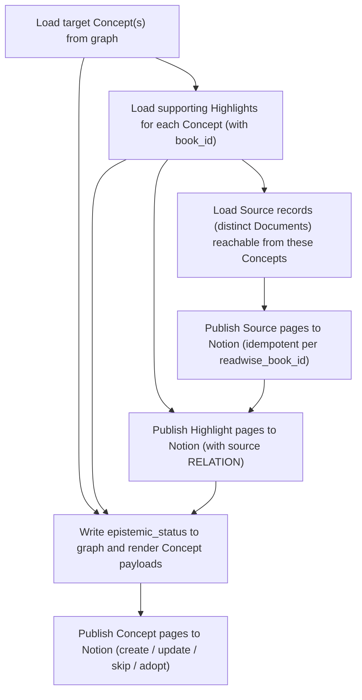

{/* AUTOGENERATED by scripts/gen-strategy-catalogue.py — do not edit. */}
{/* Source: strategies/knowledge-garden/traversal/notion_publish/ */}

# notion-publish

Publish the knowledge-garden Concepts, Highlights, and Sources to Notion as a three-database mirror (Sources DB <- Highlights DB <- Concepts DB, linked via RELATION columns). Idempotent via Publication nodes keyed by sink + external_id + content_hash. All Notion tool calls go through ctx.mcp.call_tool directly against the hosted Notion MCP surface.

| | |
|---|---|
| **Domain** | `knowledge-garden` |
| **Category** | `traversal` |
| **Version** | `1.0.0` |
| **Tags** | `traversal`, `knowledge-garden`, `notion` |
| **Source** | [`strategies/knowledge-garden/traversal/notion_publish/`](https://github.com/darkquasar/fracta/tree/main/strategies/knowledge-garden/traversal/notion_publish) |

## About

## What this strategy does

Renders a `Concept` (or a batch of top-N concepts by confidence) into a
Notion page and creates-or-updates it idempotently. Uses a
`Publication` node — keyed by `(sink='notion', concept_name)` — to track
the Notion `page_id` and a SHA-256 content hash so that re-running with
unchanged inputs is a true no-op (no Notion API calls).

This is the third stage of the Reading Garden pipeline: once
`cross_source_concepts` has scored Concepts, `notion_publish` materialises
the high-confidence ones into Notion.

## When to use it

- After `cross_source_concepts` has computed up-to-date confidence scores.
- On a single `concept_name` for manual / spot publishing.
- In batch mode (omit `concept_name`) for a periodic publish cycle —
  picks the top-N by confidence.

## How it works

Four steps:

1. **load_target_concepts** — single concept by name, or top-N by
   confidence from the graph.
2. **load_supporting_highlights** — for each target concept, pull up to
   20 supporting `Highlight` nodes (with parent `Document`).
3. **render** — derive `epistemic_status` from `confidence` (`<0.4`
   seedling, `0.4-0.8` budding, `>0.8` evergreen), persist it on the
   `Concept` (this strategy is the writer-of-record for the property),
   build the Notion block-children payload, compute SHA-256
   `content_hash` of (blocks + writable properties).
4. **publish** — per concept:
   - Lookup `Publication` locally. If hash matches → **skip** (no API).
   - If a Publication exists but hash differs → `notion-update-page` +
     `append-block-children`.
   - If no local Publication → `notion-query-data-sources` by
     `concept_name` to find an adoptable Notion page →
     `notion-update-page` + `append-block-children` if found, else
     `notion-create-pages`.
   - Update `Publication.content_hash`, `Publication.last_updated_at`,
     and wire `Concept -[:PUBLISHED_AS]-> Publication`.

## Ownership seam (read me before editing)

This strategy writes **`Concept.epistemic_status`**, the entire
`Publication` node lifecycle, and the `PUBLISHED_AS` edge.

It does **NOT** write `Concept.confidence`,
`Concept.extraction_score`, or `Concept.mention_count`. Those belong
to `cross_source_concepts` and `highlight_distill` respectively. If
`confidence` and `epistemic_status` drift apart, the
`concept_confidence_status_mismatch` checkpoint rule (spec §3.5) flags
it — that is the intended signalling channel, not a tactical override.

## What you need to adapt in your binding

`notion_database_id` is passed at run time (not in the binding) because
it is per-publish-target, not per-environment. Change `notion` to your
registered Notion MCP server config_key if it is named differently.

## Caveats

- **Block update is wipe-and-replace by default.** `append-block-children`
  is called with the freshly rendered children; the prior body history
  is not preserved. A future flag (`preserve_history`) can opt into an
  append-only mode.
- **Notion rate limit: 3 req/s.** Each create costs 1 call; each update
  costs 2 (`notion-update-page` + `append-block-children`). Batch of
  100 concepts ≈ 2.5 minutes wall-clock.
- **OAuth via the fracta gateway.** Static Notion integration tokens
  do not work with the hosted Notion MCP. The fracta gateway drives the
  PKCE OAuth dance itself (see `fracta config mcp auth login notion`)
  and the resulting grant carries the same Notion permissions as the
  user who authorised it — no per-database sharing step is required.

## Steps

| Step | Function | Depends on |
|---|---|---|
| Load target Concept(s) from graph | `load_target_concepts` | — |
| Load supporting Highlights for each Concept (with book_id) | `load_supporting_highlights` | `load_target_concepts` |
| Load Source records (distinct Documents) reachable from these Concepts | `load_sources` | `load_supporting_highlights` |
| Publish Source pages to Notion (idempotent per readwise_book_id) | `publish_sources` | `load_sources` |
| Publish Highlight pages to Notion (with source RELATION) | `publish_highlights` | `load_supporting_highlights`, `publish_sources` |
| Write epistemic_status to graph and render Concept payloads | `render_concepts` | `load_target_concepts`, `load_supporting_highlights`, `publish_highlights` |
| Publish Concept pages to Notion (create / update / skip / adopt) | `publish_concepts` | `render_concepts` |

## Parameters

| Name | Type | Required | Default | Description |
|---|---|---|---|---|
| `concept_name` | `str` | no | `—` | Single concept to publish; omit for batch (top-N by confidence) |
| `notion_concepts_database_id` | `str` | yes | `—` | Notion data_source_id of the Concepts DB (Concept pages) |
| `notion_highlights_database_id` | `str` | yes | `—` | Notion data_source_id of the Highlights DB (one page per Readwise highlight) |
| `notion_sources_database_id` | `str` | yes | `—` | Notion data_source_id of the Sources DB (one page per Readwise book/article) |
| `batch_size` | `int` | no | `10` | Number of top-confidence Concepts to publish when concept_name is omitted |
