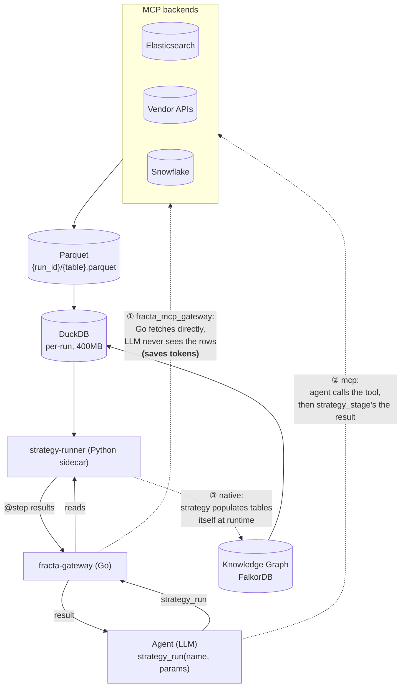

# Strategy Developer Guide

Strategies are reusable Python DAG pipelines that run inside a sidecar process. **DuckDB is the engine.** Data staged from MCP backends lands as Parquet, gets loaded into a per-run DuckDB instance, and every `@step` reads through `ctx.duckdb`. Joins, aggregations, and correlations happen at native speed in columnar storage — no LLM, no per-row Python loops. Strategies return structured results.

A strategy lives as three files: `contract.yaml` (what data it needs), `strategy.py` (the DAG of steps), and an optional `binding.yaml` (how to fetch the data in your environment). The first two are publishable and portable; the binding plugs the strategy into your specific stack.

## In this section

- [Quick Start](/strategies/quickstart) — build a minimal end-to-end strategy with all three files
- [Portability](/strategies/portability) — why `contract.yaml` + `strategy.py` are separate from `binding.yaml`
- [Contracts](/strategies/contracts) — full `contract.yaml` schema reference
- [Bindings](/strategies/bindings) — full `binding.yaml` schema, fetch modes, pagination
- [Response Adapters](/strategies/response-adapters) — parsing non-JSON tool responses
- [Lifecycle](/strategies/lifecycle) — discovery, hot reload, governance status

The rest of this page is the framework reference — authoring paths, directory layout, the contract and binding schemas at a glance, the Python step framework, data flow, and the MCP tools agents use to interact with strategies.

<hr />

## Authoring Paths

There are two supported ways to create strategies:

1. **Manual filesystem authoring** — create `contract.yaml`, `strategy.py`, and optional `binding.yaml` under `strategies/<domain>/<category>/<slug>/` (e.g. `strategies/security/enrichment/elastic_field_survey/`).
2. **MCP-driven creation** — call `strategy_create` with Python code plus either:
   - `contract` (preferred, YAML string for `contract.yaml`)
   - `metadata` (legacy JSON path)

`strategy_create` writes the strategy files through the sidecar and can also register governance nodes in the graph when the graph is connected.

Use manual authoring when iterating locally in the repo. Use `strategy_create` when an agent or operator is compiling exploratory work into a reusable strategy through  fracta itself.

<hr />

## Directory Layout

```
strategies/
  <domain>/                # e.g. security, infra, finance — your top-level grouping
    <category>/            # e.g. enrichment, hunt, detection, correlation, traversal
      <strategy_slug>/
        contract.yaml      # Required: metadata, params, data requirements
        strategy.py        # Required: Strategy subclass with @step methods
        binding.yaml       # Optional: maps tables to concrete MCP data sources
```

The runner walks `strategies/` recursively on every call and picks up any directory with both `contract.yaml` and `strategy.py`. Nesting depth is up to you — the runner uses `os.walk`, so `strategies/security/enrichment/elastic_field_survey/` works the same as a flatter `strategies/enrichment/elastic_field_survey/`. See [Lifecycle](/strategies/lifecycle) for the full discovery and hot-reload rules.

The convention is **domain first, then category**. `<domain>` is your top-level grouping (e.g. `security`, `infra`, `finance`); `<category>` is the strategy type within that domain. The directory layout is purely organizational — a strategy's identity is the `name` field in its `contract.yaml`, not its path.

<hr />

## Contract Reference

The `contract.yaml` defines what the strategy does, what parameters it accepts, and what data it needs.

### Required Fields

```yaml
name: "strategy-name"         # Unique identifier, hyphenated
version: "1.0.0"              # Semantic version
description: >                # What this strategy does
  Multi-line description.
tags: [hunt, dns, anomaly]    # At least one tag required
```

### Parameters

```yaml
params:
  time_start:
    type: str                 # str | int | float | bool
    required: true
    description: "ISO 8601 start time"
  severity_threshold:
    type: int
    required: false
    default: 50
    description: "Minimum severity score"
```

Types are validated and coerced at runtime: float64 → int, string → bool, etc.

### Data Requirements

```yaml
requires:
  graph: false                # Whether the strategy needs FalkorDB access
  tables:
    alerts:
      description: "Alert data from VendorSecurity"
      optional: false         # Required tables must be staged before execution
      columns:
        alert_id:
          type: VARCHAR
          semantic: alert_id  # Semantic tag enables auto-resolve
        severity:
          type: INTEGER
        detected_at:
          type: TIMESTAMP
```

**Column types**: Any valid DuckDB type — `VARCHAR`, `INTEGER`, `BIGINT`, `DOUBLE`, `TIMESTAMP`, `BOOLEAN`, etc.

**Semantic tags**: Optional hints that enable the auto-resolve pipeline to match columns to MCP backend fields. Without semantic tags, a `binding.yaml` is required for auto-staging.

### Backend Pinning and Discovery Hints

```yaml
pinned_backend: elasticsearch  # Strategy always uses this backend

discovery:
  description: >
    How the orchestrator should stage data for this strategy.
  mcp_hints:
    - tool: "elasticsearch.search"
      purpose: "Fetch sample documents"
      stage_as: "my_data"
```

`pinned_backend` tells the resolver which MCP backend to use. `mcp_hints` are advisory — they guide the orchestrator and auto-resolve pipeline.

<hr />

## Binding Reference

The optional `binding.yaml` maps contract table requirements to concrete MCP data sources. Required when columns lack semantic tags for auto-resolve.

```yaml
source_bindings:
  alerts:
    backend: vendor
    config_key: vendor_mcp
    fetch_mode: mcp              # See fetch modes below
    mcp_tool: search_alerts
    mcp_server: vendor
    query_template: |
      [{"fieldId": "severity", "values": ["{{severity_filter}}"]}]
    field_map:
      alert_id: id               # table column: source field
      severity: severity
      detected_at: detected_at
```

### Fetch Modes

| Mode | Who fetches | When | Use case |
|---|---|---|---|
| `fracta_mcp_gateway` | Go (MCP client pool) | Inline at strategy_run time | Default for gateway-connected backends. Auto-staged. |
| `mcp` | Agent (via `strategy_stage`) | Agent calls tool, stages result | When agent must orchestrate the fetch (e.g., multi-step queries) |
| `native` | Strategy Python code | At runtime via `ctx.graph` or `ctx.duckdb` | Graph-only strategies that populate tables themselves |

### Query Templates

Templates use `{{param_name}}` placeholders resolved from strategy params:

```yaml
query_template: |
  {"index": "logs-*", "query": {"range": {"@timestamp": {"gte": "{{time_start}}"}}}}
```

### Field Mapping

`field_map` renames source fields to match contract column names:

```yaml
field_map:
  alert_id: id           # contract column "alert_id" ← source field "id"
  asset_name: asset.name # nested source field with dot notation
```

### Pagination (for large tables)

```yaml
pagination:
  mode: offset           # offset | cursor
  page_size: 10000
  offset_param: "from"
  limit_param: "size"
```

Background staging is used for large paginated `fracta_mcp_gateway` fetches. The current heuristic is:
- `pagination` is configured
- and `max_rows > 50000`

When that path is selected, the agent receives `{"status": "staging"}` and can poll with the `session_id`.

<hr />

## Python Framework

### Strategy Base Class

Every strategy is a Python class that extends `Strategy`:

```python
from fracta_strategies import Strategy, step

class MyStrategy(Strategy):
    @step("Step name")
    def my_step(self, ctx):
        return {"key": "value"}
```

### @step Decorator

Marks a method as a pipeline step. Steps run in topologically sorted order.

```python
@step("Human-readable step name")
def my_step(self, ctx):
    ...
```

**Dependencies** are inferred from parameter names:

```python
@step("Load data")
def load_data(self, ctx):
    return ctx.duckdb.execute("SELECT * FROM my_table").fetchall()

@step("Process")
def process(self, ctx, load_data):  # ← depends on load_data
    return [transform(row) for row in load_data]

@step("Report")
def report(self, ctx, load_data, process):  # ← depends on both
    return {"raw": len(load_data), "processed": len(process)}
```

For explicit ordering, use `depends`:

```python
@step("Cleanup", depends=["process"])
def cleanup(self, ctx):
    ...
```

### StrategyContext

Every step receives `ctx` with:

| Field | Type | Description |
|---|---|---|
| `ctx.duckdb` | `duckdb.Connection` | Fresh per-run DuckDB (400MB memory limit, spill to disk). Staged tables are pre-loaded. |
| `ctx.graph` | `FalkorDB client` or `None` | Knowledge graph access. Only available when `requires.graph: true` and graph is configured. |
| `ctx.params` | `dict` | Validated and type-coerced parameters from the caller. |
| `ctx.mcp` | `MCPGatewayClient` or `None` | Gateway client for mid-execution MCP tool calls. Available when the gateway is configured and `strategy.gateway_access: true`. See [Runtime API](runtime-api.md#ctxmcp--gateway-tool-access-mid-execution). |

### Querying Staged Data

Tables declared in `requires.tables` are loaded into DuckDB from Parquet before execution:

```python
@step("Analyze alerts")
def analyze(self, ctx):
    high = ctx.duckdb.execute(
        "SELECT count(*) FROM alerts WHERE severity > ?",
        [ctx.params.get("severity_threshold", 50)]
    ).fetchone()[0]
    return {"high_severity_count": high}
```

### Querying the Knowledge Graph

When `requires.graph: true`:

```python
@step("Find related systems")
def find_systems(self, ctx):
    result = ctx.graph.query(
        "MATCH (s:System)-[:DETECTED_ON]-(e:Event) "
        "WHERE e.semantic = 'credential_theft' RETURN s.name, count(e)"
    )
    return [{"system": r[0], "events": r[1]} for r in result.result_set]
```

### Mid-Execution Tool Calls (ctx.mcp)

When the gateway is configured and `strategy.gateway_access: true`, strategies can call MCP tools during execution for targeted follow-up queries:

```python
@step("Enrich suspicious IPs")
def enrich_ips(self, ctx, detect_anomalies):
    if not ctx.mcp:
        return {"skipped": "no gateway access"}

    enriched = []
    for ip in detect_anomalies["suspicious_ips"][:10]:
        result = ctx.mcp.call_tool("elastic.platform_core_search", {
            "query": f"source.ip:{ip} AND event.category:authentication",
            "index": "logs-*",
            "size": 100,
        })
        enriched.append({"ip": ip, "auth_events": result})
    return {"enriched": enriched}
```

**When to use `ctx.mcp` vs pre-staging:**

| Use `ctx.mcp` when... | Use pre-staging when... |
|---|---|
| Follow-up queries depend on intermediate results | Data requirements are known upfront |
| Fetching targeted data for a small set of IOCs | Bulk data needed for joins/aggregations |
| The query can't be formulated until mid-execution | DuckDB columnar processing is the goal |

See [Runtime API](runtime-api.md) for full documentation.

<hr />

## Data Flow

### DuckDB is the engine

DuckDB is a core construct of the strategies framework, not an implementation detail. Every strategy run gets a fresh in-process DuckDB instance (400 MB memory, spill-to-disk enabled). All staged data lands in that DuckDB as tables. Every `@step` reads through `ctx.duckdb`. The Python in `strategy.py` is essentially orchestration around DuckDB queries — joins, aggregations, window functions, and CTEs run at native speed against columnar storage, not as Python loops over dicts.

This is what makes strategies cheap and deterministic. A correlation across two ten-million-row tables is a SQL join in DuckDB — milliseconds, no LLM, identical answer every time.

### How data gets into DuckDB

The fetch mode declared in `binding.yaml` decides who pulls the data. The choice has direct cost implications:



The three fetch modes:

| Mode | Who fetches | LLM in the loop? | When to use |
|---|---|---|---|
| **`fracta_mcp_gateway`** | Go gateway, via the MCP client pool | **No** — the gateway pulls bytes straight into Parquet | Default for any backend reachable through the gateway. **This is the token-saver:** the agent calls `strategy_run` once, the gateway does the work, and the LLM only ever sees the strategy's structured result. |
| **`mcp`** | The agent itself, via MCP tools | **Yes** — the agent calls the tool, gets the response, and stages it via `strategy_stage` | When the fetch needs LLM judgement: multi-step queries, conditional follow-ups, or backends only accessible through the agent's MCP routing. |
| **`native`** | The strategy's Python code at runtime | **No** | Graph-only strategies, or strategies that compute their own tables (e.g. cross-joins of other staged tables, synthetic enrichments). |

The cost story is exactly the column "LLM in the loop": if the LLM doesn't see the rows, you don't pay for them. A strategy that pulls a million events through `fracta_mcp_gateway` and joins them in DuckDB costs the same in tokens whether it returns ten rows or zero — because the LLM only ever sees the final summary.

### The runtime sequence

```
strategy_run → gateway loads contract.yaml + binding.yaml
            → resolver picks fetch mode per table (binding or auto-resolve)
            → data lands as Parquet at {staging_dir}/{run_id}/{table}.parquet
            → runner loads Parquet into a fresh DuckDB (one per run)
            → @step methods execute in DAG order, reading via ctx.duckdb
            → result returned to the agent; Parquet cleaned up
```

Each run gets a unique 8-character hex ID. Parquet files are cleaned up after execution. Two concurrent runs of the same strategy never share DuckDB or Parquet state.

<hr />

## MCP Tools

Agents interact with strategies through these MCP tools:

| Tool | Purpose |
|---|---|
| `strategy_list` | List all discovered strategies. When the graph is connected, results include governance status. |
| `strategy_describe` | Get full details for a strategy including resolution plan |
| `strategy_run` | Execute a strategy. Auto-resolves data, runs steps, returns result. |
| `strategy_create` | Create a new strategy from Python code plus `contract` YAML (preferred) or legacy `metadata` JSON |
| `strategy_stage` | Manually stage MCP results as Parquet (for `fetch_mode: mcp`) |
| `strategy_stage_status` | Query persistent staging progress for a run (`session_id`) |
| `strategy_resolve` | Preview the resolution plan without executing |
| `strategy_match` | Find strategies matching an investigation intent (scored) |
| `strategy_promote` | Advance a strategy from validated to promoted status |

`strategy_list` does not filter by status by default; pass `status="validated,promoted"` (or `"exploratory"`, `"all"`) to filter. See [Lifecycle](/strategies/lifecycle#governance-status) for the governance-status model.

### strategy_run Response States

| Status | Meaning | Next action |
|---|---|---|
| `complete` | Strategy executed successfully | Read `result` and `trace` |
| `error` | Strategy failed | Read `error` and `structured_error` |
| `pending` | Agent must stage data | Call `strategy_stage` for each pending table, then retry with `session_id` |
| `staging` | Background staging in progress | Retry with `session_id` to poll or get result |
| `executing` | Another caller is running this session | Wait and retry with `session_id` |

<hr />

## Error Handling

### Partial Results

When a step fails, all previously completed step outputs are preserved:

```json
{
  "status": "error",
  "error": "step 'analyze' failed: division by zero",
  "partial_results": {
    "load_data": [{"id": "1"}, {"id": "2"}]
  },
  "trace": {
    "steps": [
      {"name": "Load data", "status": "ok", "duration_ms": 12},
      {"name": "Analyze", "status": "error", "duration_ms": 1, "error": "division by zero"}
    ]
  }
}
```

Partial results are capped at 16 KB per step and 64 KB total.

### Structured Errors

Strategy errors include classification for client-side handling:

```json
{
  "structured_error": {
    "message": "auto-resolve failed: ...",
    "category": "transient",
    "retryable": true,
    "phase": "resolution"
  }
}
```

Categories: `transient` (retryable), `permanent` (fix required), `validation` (bad input), `partial` (strategy ran but incomplete).

<hr />

## Deployment

### Docker Image

Strategies are baked into the Docker image at `/opt/fracta/strategies/`. The `Dockerfile` copies the `strategies/` directory:

```dockerfile
COPY strategies/ /opt/fracta/strategies/
```

For hot reload (deploying a new or updated strategy to a running cluster without rebuilding) and the dual-container split between `strategy-runner` and `fracta-gateway`, see [Lifecycle](/strategies/lifecycle). 
